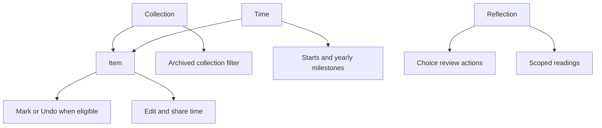

# Combined Interface Design

## Product Tasks Before Screens

An Item owns identity, optional start knowledge, independent Mark policy, and
collection placement. Time passes through Archive; a Mark means a choice on a
local day. The interface follows these tasks rather than separate Stally and
Fluel shells.

| Task | Required reading or action |
| --- | --- |
| Keep something that matters | Add name, optional note/photo and start |
| Find it again | Search, category, policy, start sorting |
| Read time together | Precision-aware elapsed range and milestone |
| Record a choice | Mark Today or Undo for an eligible Item |
| Reconsider choices | Review lanes and explicit guarded actions |
| Understand a pattern | Scoped Insights reading, including missing history |
| Put something aside | Archive without stopping time; move back later |
| Carry the collection elsewhere | Validated full export and reviewed import |
| Control the app | Independent iCloud, subscription and preferences |

## Fresh Alternative: Collection, Time, Reflection

A three-tab proposal starts outside the old screen tree:

This makes elapsed time visible as a primary destination and reduces top-level
navigation. For Canvas Tote, Collection leads to daily choices and Reflection
to reconsidering them. For Home, Collection and Time both lead to the same Item;
its unknown exact starting day must remain unknown. Archive becomes a filter.

The costs are product costs: Time duplicates Item discovery, a Home with an
unknown start disappears from its apparent primary destination, and Reflection
adds a hub before both quick Review actions and longer Insights readings.
Archive is harder to find once filters are refined. This proposal is rejected
for the first release, without depending on existing source compatibility.

## Selected Structure: Adaptive Tabs and One Item Graph

Use four stable native tabs: Library, Archive, Review, and Insights. On iPhone,
all four are directly available without first backing out to a sidebar. On
regular iPad, the native adaptable tab bar can become a sidebar. Each tab owns
its navigation path; switching tabs preserves the current Item position.
External routes select their intended tab and establish a fresh path there.
A shared UI reading date refreshes on scene activation, timezone changes, and
significant clock changes, so retained rows and reflection screens do not keep
yesterday's date-dependent readings. Operations still capture a fresh action
date when writing; this presentation value never changes durable history.

Library means the active collection of things and places, independently of
Mark policy. It gives both Item kinds equal name/category/note hierarchy. A
known start also shows precision-aware elapsed time in the row, before opening
detail. Mark status and choice counts appear only when recording is enabled.
Archive uses that same row: it is another placement, never a stopped clock.

Review remains a separate action destination because it asks what to do with
choice history. Insights remains a reading destination because it summarizes
an explicitly chosen scope. Time belongs to the Item in both collection
browsing and detail, with start-aware refinement for focused exploration.
Neither reflection surface turns non-Mark Items into unused choices.

| Existing surface | Decision |
| --- | --- |
| Library | Keep collection role; rebuild time-aware row and navigation |
| Archive | Keep visible retrieval destination; use the same time-aware row |
| Review | Keep action lane role; direct tab access |
| Insights | Keep scoped reading role; direct tab access |
| Item Detail | Keep one Item graph, time/history and visible eligible actions |
| Add Item | Keep native form; default category Other for combined domain |
| Settings | Keep native sheet; toolbar access in every tab |
| Data transfer | Keep focused reviewed workflow under Settings/empty state |

Add, Settings, and sharing stay toolbar or sheet actions; they are not tabs.
Milestones remain derived readings, without a new timeline or stored event.
The full transfer contract and system action annotations have their own Issues.

## Visual and Adaptive Rules

Use native TabView, NavigationStack, List, Form, sharing, sheets, and alerts.
Use the selected MHUI 2.3.0 revision for semantic row typography, metadata,
badges, section rhythm, primary actions, key/value rows, and native chrome.
No shared design-system fork or new dependency is needed. App composition adds
only the domain's time reading and placement hierarchy.

Rows wrap names and supporting metadata. Accessibility text sizes put the
Marked badge below the name and category/count metadata on separate lines.
The row combines its children in name, state, category/count, start/time, note
order. Native navigation, controls, form semantics, and tab labels retain
individual accessibility roles. Notes are excerpts; the complete note remains
available in detail.

Empty Library offers Add, optional explicit sample creation, and Import Data.
Sparse and mixed collections use the same rows; non-Mark Items need no empty
choice-count decoration. Dense collections use native scrolling, search and
refinement rather than compressed text or a dashboard of cards. Compact search
uses the native navigation drawer, revealed by pulling the list down. All four
tabs remain present with empty explanations when readings are unavailable.

Layout follows the actual native window and Dynamic Type environment. There
are no device-name, screen-size, orientation, or symmetric-inset assumptions.
DEBUG-only larger-text launch overrides enable reproducible review without
changing system preferences. They never replace the production environment.

This interpretation uses Apple's [tab bar][tabs], [sidebar][sidebars], and
[accessibility][accessibility] guidance, with the native
[adaptable TabView][adaptive] contract. The selection is an app design decision,
not an assertion that HIG requires these exact four sections.

[tabs]: https://developer.apple.com/design/human-interface-guidelines/tab-bars
[sidebars]: https://developer.apple.com/design/human-interface-guidelines/sidebars
[accessibility]: https://developer.apple.com/design/human-interface-guidelines/accessibility
[adaptive]: https://developer.apple.com/documentation/swiftui/enhancing-your-app-content-with-tab-navigation

## Verification

### Native Before and After Evidence

Captured on September 30, 2026 with Xcode 27.0 (27A266a), iOS 27.0 Simulator
(24A434), and synthetic in-memory collections. The baseline is the app before
this change. Images below are original native captures; the private run also
retains their complete accessibility hierarchies.

| Coverage | Before | After |
| --- | --- | --- |
| Mixed iPhone | [Library][before-phone] | [English][after-en], [Japanese][after-ja] |
| Navigation | [Sidebar][before-sidebar] | [Retained detail][retained] |
| Review and Insights | Sidebar destinations | [Review][review], [Insights][insights] |
| Empty and dense | Existing native lists | [Empty][empty], [Dense][dense] |
| Non-Mark collection | Existing time scenarios | [Time together][time] |
| Larger text | Existing system sizing | [Mixed][large], [Long name][long] |
| Add Item | Clothing-oriented default | [Other default][add] |
| Regular iPad | [Split sidebar][before-ipad] | [Tabs][ipad], [Sidebar][sidebar] |
| Changed iPad width | Baseline portrait | [Landscape][landscape], [Draft][draft] |

The iPhone window is 402 × 874 points. Home and Window Plant now show elapsed
readings alongside their year/month starts; Canvas Tote retains its 3 Marks.
Switching from Home detail to Review and back preserves the Library path.
Pulling down reveals native search; entering `Soft` filters the dense collection
to one long-name Item. Non-Mark-only Review remains empty, and Insights keeps
whole-scope note/photo coverage without creating choice metrics.

At accessibility3, category/count and the Marked badge stack, and the long
sweater name wraps across four complete lines. Native scrolling reaches detail
actions. Add retains unknown start knowledge and an explicit Record Marks
control, with Other as the untouched category.

On iPad, tabs morph into a native sidebar overlay. The actual live window
changes from 1032 × 1376 to 1376 × 1032 points and back. Home detail and an
unsaved name draft survive these transitions in the same process. Cancel
discards the draft and leaves Home's year-only start and Mark policy unchanged.

Combined row hierarchy order is name, optional Mark state, category, applicable
count, start, elapsed reading, and note. Non-Mark rows omit choice state/count.
Native tabs expose their labels and selection; detail actions remain separate
controls. This verifies accessibility hierarchy order, not spoken VoiceOver
focus traversal: that control is absent from the available integration.

### Verification Boundaries

An attempted native iPad floating-window resize entered App Switcher when
activating the system-owned resize handle. No narrow floating-window transition
is claimed. Actual regular-width transitions above and compact iPhone are
verified separately. There are no observed layout failures in those captures.
Physical VoiceOver speech, keyboard/pointer behavior, and other window sizes
remain additional coverage.

One native screenshot session lost its screen scale and app process alongside
a Simulator service restart boundary. An identical synthetic relaunch produced
stable larger-text evidence. No app crash report or fatal log identified an
application cause; the initial exit cause remains unproven.

All ten scenario launches reached the synthetic-container and startup ready
logs, including the recovered run. No app-owned fatal, crash, exception, or
SwiftData/ModelContainer failure was observed. Nonfatal Simulator and SDK diagnostics remain in private
logs. These runs do not prove real iCloud sync, purchases, ads, or release
readiness. All owned runs and interaction sessions were ended; ordinary data
and global preferences were preserved.

After the shared reading-date change, two additional launches of the final
binary confirm [detail after scene activation][activation], Edit/Share controls,
tab path retention, and [larger-text stacking][final-large]. Both reach startup
ready without app-owned fatal output. Calendar advancement was not forced.

The app build extracts App Intents metadata. Formatter, repository rules,
English/Japanese catalog audit, Markdown lint, and diff whitespace checks pass.
Library behavior is unchanged; the prior 159-test library result is retained.
Xcode scheme/destination discovery hangs in this environment, so the build uses
the explicit Xcode 27.0 command-line toolchain and discovered dedicated device.
The original Xcode selection, Stally / My Mac, was never changed.

[before-phone]: ui-preview-screenshots/combined-interface/before/library-iphone.png
[before-sidebar]: ui-preview-screenshots/combined-interface/before/sidebar-iphone.png
[before-ipad]: ui-preview-screenshots/combined-interface/before/library-ipad.png
[after-en]: ui-preview-screenshots/combined-interface/after/library-iphone-en.png
[after-ja]: ui-preview-screenshots/combined-interface/after/library-iphone-ja.png
[retained]: ui-preview-screenshots/combined-interface/after/home-detail-retained.png
[review]: ui-preview-screenshots/combined-interface/after/review-native-tab.png
[insights]: ui-preview-screenshots/combined-interface/after/insights-native-tab.png
[empty]: ui-preview-screenshots/combined-interface/after/library-empty.png
[dense]: ui-preview-screenshots/combined-interface/after/library-dense.png
[time]: ui-preview-screenshots/combined-interface/after/library-time-together.png
[large]: ui-preview-screenshots/combined-interface/after/library-accessibility3-lower.png
[long]: ui-preview-screenshots/combined-interface/after/library-dense-accessibility3-long-title.png
[add]: ui-preview-screenshots/combined-interface/after/add-item-default-other.png
[ipad]: ui-preview-screenshots/combined-interface/after/library-ipad-portrait.png
[sidebar]: ui-preview-screenshots/combined-interface/after/library-ipad-sidebar.png
[landscape]: ui-preview-screenshots/combined-interface/after/home-detail-ipad-landscape.png
[draft]: ui-preview-screenshots/combined-interface/after/edit-draft-ipad-portrait-retained.png

[activation]: ui-preview-screenshots/combined-interface/final/home-detail-after-activation.png
[final-large]: ui-preview-screenshots/combined-interface/final/library-accessibility3-stack.png
