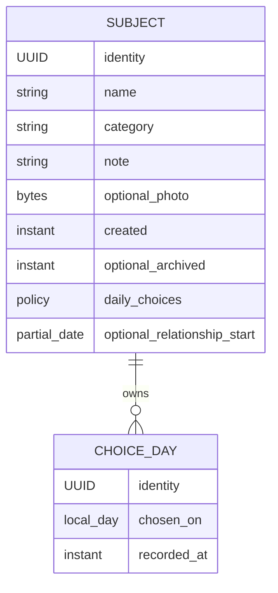

# First Release Data Model

## Decision

Stally owns a collection of personally meaningful things and places. An Item
identifies one such subject; its choice history and knowledge of when the
relationship began are independent capabilities. The first release uses one
Item aggregate with owned Marks. This is a fresh domain decision, rather than
a requirement to preserve the prototype's navigation or classes.

Retain the current V2 physical schema and tested V1 migration. Expose the Mark
policy as `ItemMarkPolicy` rather than introducing a second storage field.
There is no development-store reset. The cost of retaining the small, tested
migration is lower than introducing data loss or an unrelated bootstrap path.
This decision does not make development compatibility a permanent constraint
on future product changes.

## Domain Before Persistence

Subject identity survives editing, Archive, export, and restoration. A choice
day says that the person chose that subject on a calendar day. It says nothing
about duration, ownership, motives, or how often it was chosen within the day.
Start knowledge is an independently entered fact, with unknown, year, month,
or day precision. It is never inferred from creation time or a first Mark.

| Durable fact | Derived reading |
| --- | --- |
| Subject and Mark UUIDs | Navigation selection and current query results |
| Name, category, note, optional prepared photo | Search matches and coverage |
| Creation and optional Archive instants | Collection membership |
| Mark policy | Eligibility for choice actions and Review |
| Optional partial relationship start | Time together and annual milestones |
| Choice day and recording instant | Counts, streaks, rankings, Review lanes |

Elapsed time, milestones, Review, and Insights are readings. Reading, sharing,
opening an Item, and rendering a system result never create durable history.

## Alternatives

| Shape | Benefit | Main cost |
| --- | --- | --- |
| One subject (selected) | One identity, independent facts | Validation rules |
| Separate types/subclasses | Simple single-purpose forms | Graph conversions |
| Owned profiles | Independent history lifecycles | More cloud records |

One subject has one photo, note, Archive state, and portable record. A coat can
have both Marks and start knowledge without duplicate identities. Operations
validate the independent policy scalar and optional partial date.

Separate choice and relationship types need two identities or a joining
aggregate for that same coat. Changing capabilities becomes a graph conversion;
duplicated links and metadata add no user value. Persistent inheritance does
not resolve that lack of a mutually exclusive subtype meaning.

Optional profile children help when several histories have independent
lifecycles. Here, two small values would become extra CloudKit relationships
with partial-arrival states, without a selected workflow needing them.

The additive Item prototype is the physical baseline for the selected shape.
Its storage already represents the selected facts without a synthetic exact
start date or mutually exclusive record kinds. A Bool is sufficient for the
two stored policy states; `ItemMarkPolicy.enabled/disabled` supplies explicit
domain vocabulary without an opaque Codable blob or duplicate truth.

## Selected Semantics

- Mark capability and start knowledge are independent. Each policy can have an
  unknown, year, month, or day start.
- A Mark is a dedicated child record. Preserve UUID, local Gregorian day, and
  recording instant. One subject has at most one Mark per day through
  authoritative Operations; import validates duplicate days and identities.
- Disabling Marks is refused when history exists. A conflicting imported or
  partially synced state retains its history and is shown as incomplete.
- Archive puts a subject aside, preserves identity and Marks, and does not end
  elapsed time. Restoration clears Archive state. Deletion removes the owned
  Mark graph through the existing cascade boundary.
- Relationship ending is deferred. If selected later, it needs a separate
  entered fact and rules for partial precision; Archive must not become its
  substitute.
- Fluel-style added/updated/archived activity summaries are not a new durable
  event history. Its read-only activity builder was reviewed as a reference;
  those summaries do not establish a combined-product event requirement.
- Categories remain the existing fixed enumeration, with Other available for
  a place or another subject. Categories classify; they never determine Mark
  eligibility. User-defined categories, multiple photos, and generic activity
  events are deferred until they have an actual selected workflow.
- A prepared photo is optional owned context, stored externally by SwiftData
  and embedded portably on export. Its storage URL is not public identity.
  Photo validation and metadata removal remain `ItemPhotoOperations` rules.
- Item UUIDs are portable identity; SwiftData `PersistentIdentifier` is only
  store-local. Existing Item links continue to identify the same subject.

## Persistence and Current SDK

The selected first-release schema is `StallySchemaV2`: `Item` and `ItemMark`.
The physical fields remain explicit scalars. `recordsMarks` stores the policy;
`startRawValue` stores canonical `YYYY`, `YYYY-MM`, or `YYYY-MM-DD`, or nil.
`ItemStart` parses and validates that scalar without inventing missing parts.

CloudKit-compatible defaults, optional relationships, explicit inverse, and
cascade deletion remain in the model. Do not add unique constraints: CloudKit
cannot enforce them. UUIDs identify records; they do not promise distributed
uniqueness. Partially arriving and conflicting histories remain visible.

Current SDK capabilities were reviewed with Xcode's Apple documentation:

| Capability | First-release decision |
| --- | --- |
| Model inheritance | No distinct persistent subtype lifecycle |
| `@Attribute(.codable)` | Keep policy/date scalars queryable |
| Indexes and uniqueness | No uniqueness; index only after measured need |
| Sectioned `@Query` | Presentation choice; no stored section keys |
| `ResultsObserver` | Only for actual non-view observable consumers |
| `HistoryObserver` | Store-change observation, independent of choice history |

There are no persisted string section keys, cached totals, milestone records,
or duplicated UI entities. The main app observes the same live model graph;
Operations own validation and writes. System adapters use UUIDs and specialized
Sendable values at actor/process boundaries.

## Bootstrap and Development Compatibility

A fresh store starts directly at V2. An existing V1 development store migrates
through the retained lightweight stage: Marks remain enabled and start remains
unknown. Existing V2 stores reopen without transformation. Never regenerate
the immutable V1 fixture with the current models.

Do not delete a store or reset CloudKit after failed initialization. Preview,
tests, and synthetic migration copies use CloudKit disabled. Production schema
promotion and real-device convergence remain separate verification/actions.
Any future persisted change appends a schema and migration stage; it must not
change the meaning of a historical version.

## Portable Contract

`StallyDataContract` is the source of the current version correspondence:

| Persisted contract | Portable representation | Conversion |
| --- | --- | --- |
| V1 | Backup v2 | Mark-enabled, unknown-start defaults |
| V2 (first release) | Backup v3 | Explicit policy, nullable partial start |

The development version sequences already differ by one. Retain and document
that mapping instead of relabeling old files as another schema. This is an
intentional correspondence of durable meaning, not incidental Codable defaults.
Future changes must review both contracts together and define their conversion.

The full export includes active and archived Items, UUIDs, names, category raw
values, notes, photos, creation/Archive instants, policy, partial start, and
all Mark UUIDs/days/recording instants. Runtime preferences, subscription and
consent state, derived reports, and local navigation state are excluded: they
are environment or presentation state, not the portable collection.

Import/export evolution is owned by #14. It must retain preview before mutation,
bounded validation, source-preserving export failure, and explicit merge/replace
semantics. Existing v2/v3 fixtures remain valuable, independent evidence.

## User Journeys and Verification

The model supports a marked coat with a known start, a notebook with unknown
start, a place with only year knowledge and no Marks, and an archived bag whose
elapsed relationship continues. Each has one detail identity and one portable
record. Forms edit capabilities without converting one model kind to another.
Review considers only Mark-enabled subjects; time sharing needs valid start
knowledge, independently of Archive or Mark policy.

`StallyFirstReleaseModelTests` checks the actual generated schema's attributes,
CloudKit compatibility restrictions, and a synthetic disk round trip across
both policies and every start precision, including photo/history/Archive and
link identity. `StallyV1FixtureTests` retains independent historical-store
migration/reopen evidence. These are local schema/store checks, not production
CloudKit or multi-device sync proof. #20 owns the shared fixture vocabulary and
the modest scale check before release.

## Apple References

- [Syncing model data across a person's devices](https://developer.apple.com/documentation/swiftdata/syncing-model-data-across-a-persons-devices)
- [SwiftData model definition](https://developer.apple.com/documentation/swiftdata)
- [ResultsObserver](https://developer.apple.com/documentation/swiftdata/resultsobserver)
- [What's new in SwiftData](https://developer.apple.com/videos/play/wwdc2026/274/)
