# Item Tracking Implementation Evidence

> Updated September 14, 2026. Local implementation evidence, not distribution approval.
> App integration: `a8ac948`; UI corrections: `54f29dc`, `fcdc218`, `a9c61e6`.
> Read-only follow-up: `dae979e` (Operations), `3f6fff1` (Intent), `0f91a4f` (UI).
> Original V1 writer: `36a00d0`.

## Implemented Contract

The accepted [design](item-start-and-elapsed-time-proposal.md) is implemented
through StallyLibrary Operations, native forms and detail screens, Review,
Insights reports, Backup Center, and existing App Intents. Fluel was untouched.

- An Item retains its UUID and Mark relationship. `recordsMarks` defaults to
  true; an optional canonical `YYYY`, `YYYY-MM`, or `YYYY-MM-DD` start defaults
  to unknown. Existing timestamps and Marks never supply an inferred start.
- Elapsed time is a calendar reading, with zero on the start day. Approximate
  starts retain coarse ranges. Archive never pauses or resets the reading.
- Non-Mark items stay in Library/Archive and generic entity queries. Mark,
  Undo, action suggestions, all Review lanes, and choice metrics enforce the
  recording policy. Note/photo coverage still includes the whole scope.
- Disabling Marks requires empty history. Inconsistent history is retained and
  surfaced; explicitly enabling Marks repairs it without deleting history.
- New exports use backup v3. The strict reader accepts v3 and the frozen v2
  adapter. Matching IDs retain local details on merge, including unknown
  starts. Incoming Marks for a local non-Mark item reject the entire merge.
  A valid replacement has a separate preview and the existing confirmation.

No production CloudKit deployment, real-data migration/reset, purchase,
signing change, push, or publication was performed.

## Read-Only Fluel Follow-up

The [follow-up assessment](fluel-integration-assessment.md#september-14-follow-up-integration)
adds collection start sorting/filtering, derived yearly milestones, and a shared
localized time report for Item Detail and Check Time Together. These operations
read the existing V2 fields. They do not add storage, milestone events, Marks,
notifications, a backup version, or a second collection.

The library change at `dae979e` passed 151 tests in 35 suites on the isolated
iOS 27 Simulator, including all retained V1 disk migration, photo/link identity,
and v2/v3 backup tests. New cases cover non-Mark collection filters, stable
partial-date ordering, unknown/invalid starts, yearly periods, February 29,
year limits, Archive continuity, English/Japanese formatting, and report reads
without mutation or inclusion of unrelated private fields. The native Stally
build passed with zero errors and extracted app-owned App Intents metadata.

The test log contains expected malformed-photo/failed-store diagnostics from
negative tests and disposable-store cleanup warnings. The runner reported all
151 tests passing; those diagnostics are not a production-runtime check.

The Check Time Together adapter in `3f6fff1` passed two additional in-memory
probes against copied current app sources with only an injection helper
appended. They executed the actual Check Time Together perform method for
Mark/non-Mark Items, active/archived
states, unknown starts, and a missing saved entity. Returned reports matched the
library reading and left Mark IDs and ModelContext changes untouched. Source
hashes, the helper, and results remain in ignored follow-up artifacts. This is
adapter execution evidence, not Shortcuts/Siri system UI or authentication
presentation evidence. The new intent retains the existing UUID entity contract
and requires authentication; it has no write or route action.

The `0f91a4f` app changes adapt those readings and correct the confirmed
maximum-text truncation of exact starts in collection rows. Detailed app adapter
and screen evidence is recorded with the follow-up in
[the UI report](ui-preview-report.md#september-14-read-only-time-follow-up).
The existing manual Files, VoiceOver,
Shortcuts/Siri system UI, midnight refresh, and device-size checks remain
separate from package test results. External prerequisites are tracked in
[issue #8](https://github.com/muhiro12/Stally/issues/8).

## Persistence and Backup Evidence

The original writer produced the checked-in
[V1 fixtures](../StallyLibrary/Tests/Default/Fixtures/V1/README.md) before any
model changes. They contain an actual closed disk store, its external photo
storage, an empty store, a v2 backup, and independent photo/link expectations.
All retained SHA-256 checksums still match.

The frozen V1 entity hashes match the original store metadata. V2 adds two
scalar properties through a lightweight migration; the old definitions remain
frozen. Migration and repeated reopen compare Item/Mark UUIDs, day keys,
timestamps, names, raw categories, notes, archive state, relationship ownership,
and the original 1,255,132-byte external JPEG. Saved Item links still resolve.
New tracking values also survive two disk reopens.

A deliberately read-only migration fails as expected and leaves the independent
original fixture intact. The associated CoreData open errors belong to this
negative test. This is not a simulated mid-migration power-loss recovery test.
V2-to-V1 downgrade is unsupported: an old binary can recover the pre-conversion
V1 copy/v2 backup, while post-conversion recovery needs the new binary and v3.

| Verification layer | Result and scope |
| --- | --- |
| Initial integration library | 143 tests in 30 suites passed using `test_stally_library.sh`; the later 151-test run is recorded above |
| Original reader | Original `36a00d0` source plus one isolated probe: 115 tests in 26 suites passed |
| Old-reader refusal | A v3 payload is rejected before merge and replacement; original records, photo, Marks, and pending-change state remain identical |
| App adapter probe | 3 tests passed using copies of current app source and explicit in-memory dependency injection |
| Static checks | Standard formatter, repository SwiftLint/boundary checks, and `git diff --check` passed |
| App build | Xcode-native build passed; final official CLI build also passed after native transport closed |
| App Intents | App metadata extraction passed; UUID/name queries, filtered suggestions, non-Mark errors, and eligible Mark/dedup/Undo passed in the adapter probe |
| Localization | Six catalogs audited for en/ja; zero incomplete entries and valid placeholders |

The library suite includes malformed/partial dates, leap/month boundaries,
timezone/DST/skipped-day readings, future stored dates, unchanged-photo edits,
save rollback, Archive continuity, stale Review batches, every choice metric,
unavailable-date scope, localized reports, v2/v3 restore and merge, strict v3
keys, non-lossy v2 encoding, and existing size/photo/duplicate protections.

The adapter probe verifies that year/month refinement requires explicit missing
components and that discarding a draft leaves the Item and context unchanged.
Malformed stored starts require explicit draft repair. Its dependency values
are manually injected as supported by App Intents; it does not simulate Siri
or the Shortcuts application's runtime injection and presentation.

The original-reader and app-adapter probes run in disposable package copies;
no app test target or production verification hook was added. Their source,
source hashes, logs, and audit results are retained locally under
`.build/ci/item-tracking/`. The normal library regression tests and original
fixtures remain part of the repository test target.

The existing `Actions` catalog key became stale during Xcode extraction and is
retained. `Stally`/`CFBundleName` source-copy notices are intentional names.
No unrelated catalog keys were removed or translations changed.

## Screen Comparison

The before capture is the original Add Item Preview from the V1 baseline.
After captures are actual iPhone 18 Pro Simulator screenshots on iOS 27.0,
using Xcode `27A266a` and synthetic in-memory launch data. Images are unedited.
The before form is presented directly; the after Add form is its normal sheet.

| Before | After |
| --- | --- |
|  | 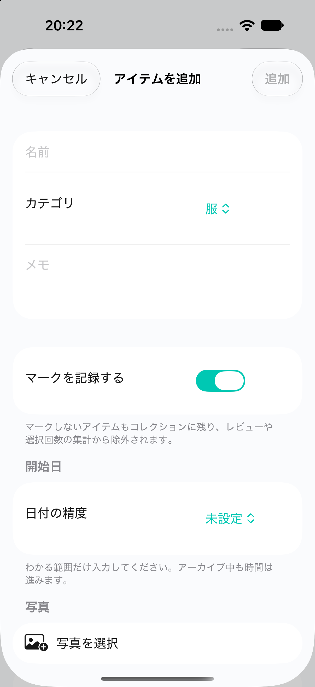 |

The existing Name, Category, Note, and Photo fields remain. The new controls
start with Marks enabled and no start date. Year/month editing keeps only the
known components, and the year retains a visible field label.

| Month precision | Archived exact day |
| --- | --- |
| 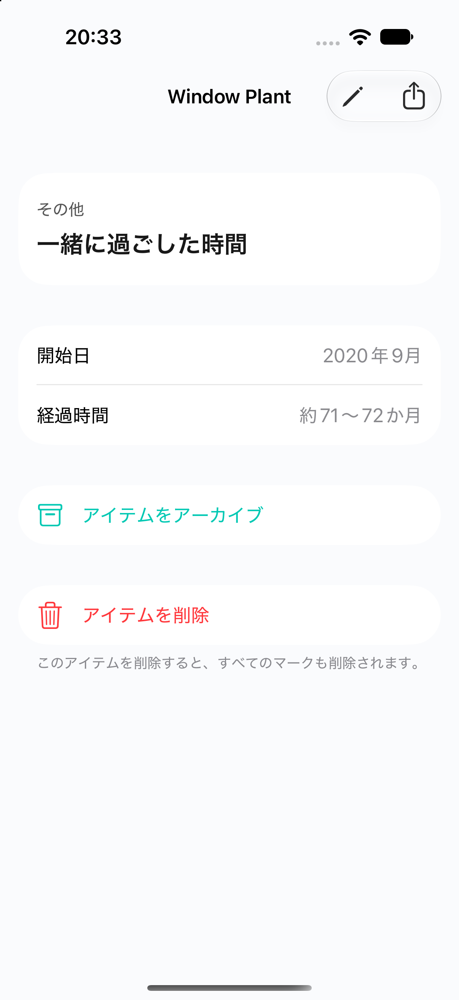 | 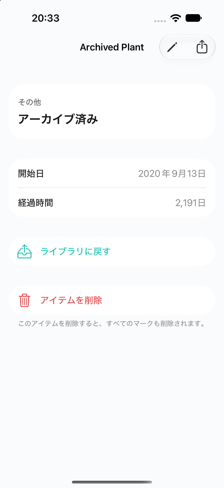 |

At the captured date, `2020` reads approximately 5–6 years, `2020-09` reads
approximately 71–72 months, and the archived `2020-09-13` reads 2,191 days.
Detail omits Mark/Undo/Adjust for non-Mark items. Archive keeps Move Back.
The duplicate time heading found during inspection was removed.

| Surface | Observed result | Capture |
| --- | --- | --- |
| Mixed Library | Non-Mark rows omit first-Mark/count/badge language; ordinary rows retain it | [Library](ui-preview-screenshots/item-tracking/library-mixed.png) |
| Year detail | Year-only start and approximate whole-year range | [Year](ui-preview-screenshots/item-tracking/year-detail.png) |
| English month detail | Localized start and elapsed range with the same non-Mark controls | [English detail](ui-preview-screenshots/item-tracking/month-detail-en.png) |
| Year editor | Year control without an invented month/day | [Year editor](ui-preview-screenshots/item-tracking/edit-year.png) |
| Month editor | Year and month controls without an invented day | [Month editor](ui-preview-screenshots/item-tracking/edit-month.png) |
| Non-Mark Insights | Explicit empty choice scope; no first-Mark invitation in the generated recommendations | [Insights](ui-preview-screenshots/item-tracking/insights-nonmark.png) |
| Mixed Review | Only the ordinary choice item appears in Needs First Mark | [Review](ui-preview-screenshots/item-tracking/review-mixed.png) |

Six new screen-level Preview definitions have equivalent runtime captures.
Direct new Preview coverage is 0/6: the first attempted definition timed out in
`PreviewsFoundationHost`; the other five were not retried after that failure.
The existing before Preview succeeded. Runtime capture uses the actual screens
and existing in-memory scenarios; detail/edit fallback hosts receive the same
seeded Items as the screen-level Previews.

Native device sessions failed with contradictory missing/occupied-session
results on the original Simulator, then a connection failure on the fallback
Simulator. Later the Xcode transport closed. Official `xcodebuild` and `simctl`
provided the final build, launched-screen captures, and runtime logs. Early
blank/transition frames were not accepted as successful screen evidence.
The app logs show preview-container creation and startup readiness, with no
observed fatal app/persistence error. Simulator service and StoreKit diagnostics
are retained separately from the deliberate migration-refusal test output.

The original Stally scheme and Simulator destination were restored and confirmed
before native transport closed. A final native re-query was unavailable; later
CLI checks did not switch Xcode's selection. CUA access to Simulator also timed
out. A link-opening confirmation interrupted one capture; the dedicated
Simulator was restarted without erasing data before obtaining the clean frame.

Touch-based Cancel/Save, picker interaction, VoiceOver, Dynamic Type variation,
the native file-import confirmation flow, and Siri/Shortcuts UI were unverified
in the initial integration run. Draft non-mutation, validation, import mode
behavior, and Intent execution have the separate code-level checks above.
The follow-up audit below records additional evidence without converting
screenshots into interaction checks.

## Follow-up Interaction and Accessibility Audit

The September 13 follow-up used a newly created iPhone 18 Pro Simulator named
`Stally Tracking Interaction Audit`, iOS 27.0, portrait, with Xcode `27A266a`.
It installed only the Debug app and launched the existing `integration` and
`timeTogether` scenarios in memory. App logs confirm preview-container creation
and startup readiness; no app fatal error was observed. No backup import,
collection replacement, account sign-in, or cloud operation was performed.

### Confirmed Defect and Bounded Correction

At the standard `large` text size in English, Edit Month displayed the selected
precision as `Year...onth`, obscuring `Year and Month`. The same synthetic Item
and launch route reproduce it. The inherited MHUI key-value layout constrained
the interactive Picker's value column.

Only the Precision Picker now opts into SwiftUI's automatic labeled-content
style. It retains the native control, strings, binding, selection, and
validation.
This follows the pinned MHUI guidance to apply key-value styling selectively and
let specialized native controls retain their own layout. No shared package,
persisted model, Operations, backup codec, or App Intent changed.

| Before: standard English size | After: same size and Item |
| --- | --- |
| 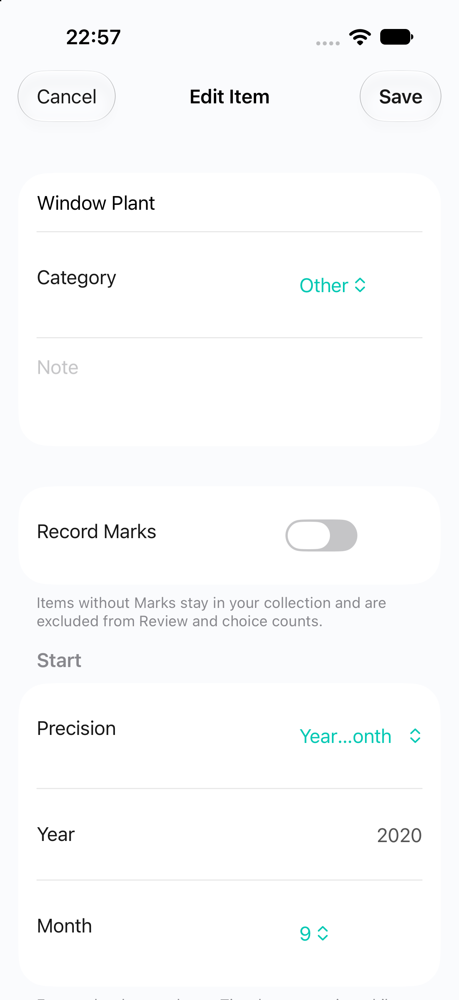 | 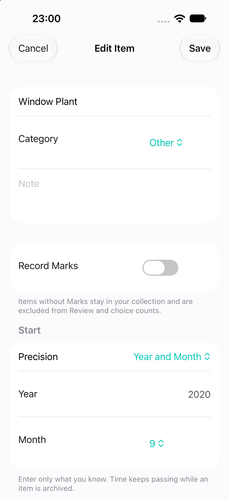 |

The post-fix native build passed with zero errors. Formatter, SwiftLint and
repository boundary checks passed. This presentation-only change does not
alter the prior 143 library, 115 original-reader, or three app-adapter tests;
those suites were not rerun or counted as new evidence for the layout fix.

The full selected value is visible at `large` and `extra-extra-extra-large`.
Year Only, Japanese month precision, and the Add form's Not Set value were also
rechecked. Maximum accessibility size places the precision control below the
initial viewport, so its readability there remains a manual check.

| Retained comparison | Coverage |
| --- | --- |
| [Larger month editor](ui-preview-screenshots/item-tracking-interaction/edit-month-xxxl-en-after.png), [Japanese month editor](ui-preview-screenshots/item-tracking-interaction/edit-month-large-ja-after.png) | Complete selected precision after the fix |
| [Year editor](ui-preview-screenshots/item-tracking-interaction/edit-year-large-en-after.png), [Add form](ui-preview-screenshots/item-tracking-interaction/add-large-en-after.png) | Neighboring year/unknown states after the fix |
| [Maximum-size Add](ui-preview-screenshots/item-tracking-interaction/add-axxxxl-en.png), [maximum-size Edit](ui-preview-screenshots/item-tracking-interaction/edit-year-axxxxl-en.png) | Initial viewport only; controls below the viewport are unverified |
| [Maximum-size month detail](ui-preview-screenshots/item-tracking-interaction/month-detail-axxxxl-en.png), [Japanese year detail](ui-preview-screenshots/item-tracking-interaction/year-detail-axxxxl-ja.png) | Start and approximate elapsed values reflow |
| [Maximum-size Insights](ui-preview-screenshots/item-tracking-interaction/insights-axxxxl-en.png) | Non-Mark scope explanation reflows |
| [Dark and increased contrast](ui-preview-screenshots/item-tracking-interaction/month-detail-large-en-dark-contrast.png) | Month-detail initial viewport |

### Audited Coverage and Limits

| Capability | Result |
| --- | --- |
| Real Simulator rendering | Standard and maximum Dynamic Type captures inspected; exact month/year readings and non-Mark Insights scope wrap in the visible viewport |
| Maximum-size forms | Add/Edit controls reflow in the initial viewport; start fields fall below it, so their scrolling/reachability remains unverified |
| Dark appearance and Increase Contrast | Month detail inspected with both settings enabled; text/actions visible without overlap, with no measured contrast-ratio claim |
| Touch/keyboard workflows | Unverified: the native session failed before any tap, picker, scroll, Save/Cancel, or keyboard event |
| Accessibility hierarchy | Unverified: no hierarchy was returned by the failed interaction session or desktop fallback |
| VoiceOver operation | Unverified and unavailable on Simulator according to Apple; manual physical-device check is separate |
| Files and Shortcuts UI | Unverified: no file-import/export confirmation or system Intent UI was operated in this follow-up |
| Other device sizes/orientations | Not audited; this targeted run covers the isolated portrait iPhone only |

The native session initially timed out. A single retry after the dedicated
Simulator had fully booted still could not connect; capture/end reported that
the session did not exist. Desktop Simulator access also timed out (`-10005`)
by both display name and the discovered bundle identifier. These are environment
failures, not app failures. Standalone Xcode-native builds and official `simctl`
installation, launch, display settings, screenshots, and logs remained usable.
No UI test target or new fixture launch hook was introduced as a workaround.

The captures are actual unedited Simulator images. Initial-viewport evidence
does not establish successful scrolling, activation, focus order, or completion
of the interaction matrix below. Apart from the reproduced precision label,
no additional defect was established in the inspected coverage.

The original Xcode scheme `Stally` and destination
`Stally MHPlatform 1.13 Audit` were restored and confirmed. The dedicated
Simulator's settings were restored
to `large`, light appearance, and disabled Increase Contrast; the app and then
the dedicated Simulator were stopped. No device was erased. The full session
ledger, 18 raw screenshots, two native build logs, app runtime logs, repository
rules, and retained-image checksums are local ignored evidence under
`.build/ci/item-tracking-interaction/`. Twelve inspected comparison images are
retained above. The earlier verification artifacts remain unchanged.

## September 14 Interaction Continuation

The same isolated iOS 27 Simulator now supports a device-specific native
interaction session against the explicitly launched Debug in-memory app.
Fresh hierarchies and settled screenshots accompany actual taps, keyboard
entry, scrolling, menus, and Save/Cancel. The earlier transport failure no
longer blocks these app interactions.

### Confirmed Operations

| Workflow | Observed result |
| --- | --- |
| Add and cancel | A named non-Mark/year-only draft was cancelled; Library stayed at six active items and the next Add form restored empty/default values |
| Add and reopen | Repeating the input and tapping Add created exactly one item; its detail showed start `2020`, approximate elapsed time, and no Mark/Undo/history controls |
| Edit and validation | Missing year/month/day disabled Save; February 29, 2020 was accepted; changing to 2021 cleared the invalid day; future year 9999 produced the localized save error |
| Cancel after validation | Cancelling the modified editor restored the original year-only start and non-Mark policy |
| Precision reduction | Exact day to month precision cleared the day; year precision cleared month and day; refinement did not restore removed values and Save remained disabled |
| Clear start and enable Marks | A valid Save removed the start/elapsed reading and enabled Mark Today; recording one Mark displayed one history entry |
| Existing history protection | Edit exposed Record Marks as on and disabled, with the history-preservation explanation; the Mark remained present |
| Maximum text interaction | Actual scrolling reached month/day menus, the validation footer, and Choose Photo; explicit February 1, 2020 was saved and detail showed 2,417 elapsed days |
| Maximum text keyboard | Editing Year from 2020 to 2021 kept the settled value/caret above the numeric keyboard and Cancel/Save reachable; Cancel restored the original 2020 start |
| Archive and restore | Archiving that non-Mark item and moving it back preserved the exact start and elapsed display; Mark controls remained absent |
| Review and Insights scope | After disabling Marks on the unmarked Daily Field Notes item, Library stayed at six active items. Needs First Mark and Dormant were empty; Recovery contained only Travel Weekender. The 30-day Insights choice scope had 15 Marks, 13 active days, three unique items/categories; photo coverage retained the whole six-item scope |
| File selection cancellation | A fresh native session recovered the system picker; actual Cancel returned without a false failure alert and preserved eight total items, two archived items, and 23 Marks |
| Original v2 merge | Downloading the byte-identical disposable fixture and selecting it through Files opened a valid preview; confirming Merge added four items/four Marks and produced 12 total items, three archived items, and 27 Marks |
| Original v2 replacement | Changing mode selected a separate destructive action; cancelling retained 12/3/27 counts. Explicitly confirming Replace produced the original four items, one archived item, and four Marks |
| Legacy defaults in UI | The restored, unmarked V1 Fixture 3 showed Start Not Set, zero Marks, and enabled Mark Today/history controls |
| Existing photo and history | A start-only edit of archived V1 Fixture 2 saved `2020` and the approximate elapsed reading while retaining its synthetic photo, Japanese note, archive state, and two Marks |
| v3 conflict protection | Replacing with the synthetic non-Mark v3 fixture produced 4/1/4 counts. Selecting the marked v3 fixture in Merge displayed the policy-conflict reason, zero added Marks, and a disabled Merge action; tapping it changed nothing |
| v3 replacement | The same marked v3 input had a valid, separate Replace preview; explicitly confirming Replace produced four items, one archived item, and five Marks |

Accessibility hierarchies expose named controls and current values for the
tracking fields, combined start/elapsed detail values, disabled Add/Save, and
the history-locked switch. This is hierarchy evidence, not VoiceOver speech
or focus-navigation evidence. The Year field accepted input after tapping its
visible value region; its broad hierarchy hit point falls in the label region.
The settled standard-size field remained visible above the keyboard.

### Additional Confirmed Label Corrections

Actual precision refinement revealed truncated `Choose Month` and `Choose Day`
values at the standard English size. Both native Pickers now opt into automatic
labeled-content styling, matching the earlier Precision correction. At maximum
accessibility size, `Choose Month` still exceeded the native selected-value
width, and the month-precision title `Year and Month` was also truncated.

Correction `fcdc218` uses the existing localized `Not Set` value; the Month and Day
row labels supply the context. The month-precision option uses the existing
`Month` label. English and Japanese values are already translated. Only the
three replaced, unreferenced catalog keys were removed. Required components,
calendar validation, bindings, selection values, and the native menus are
unchanged; no model, migration, Operations, or backup codec changed.

| Standard English before | Standard English after |
| --- | --- |
| 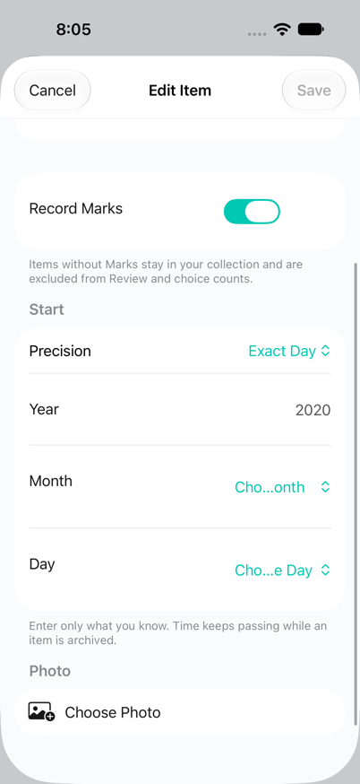 | 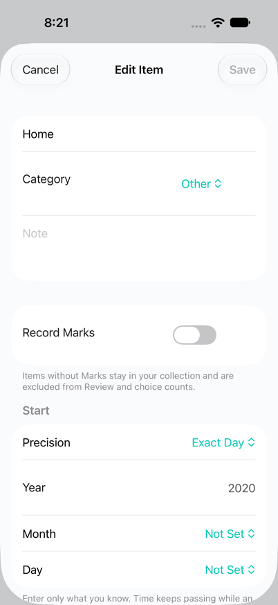 |

The [maximum-size month/day capture](ui-preview-screenshots/item-tracking-continuation/month-day-maximum-text-after.png)
shows complete unset values after actual scrolling, with Save disabled.
The [Japanese maximum-size capture](ui-preview-screenshots/item-tracking-continuation/month-day-maximum-text-ja.png)
shows the corresponding localized values. Actual month/day menu selection
enabled Save in both languages, and Year Only/Month refinement retained the
required-component checks.

| Maximum English precision before | Maximum English precision after |
| --- | --- |
| 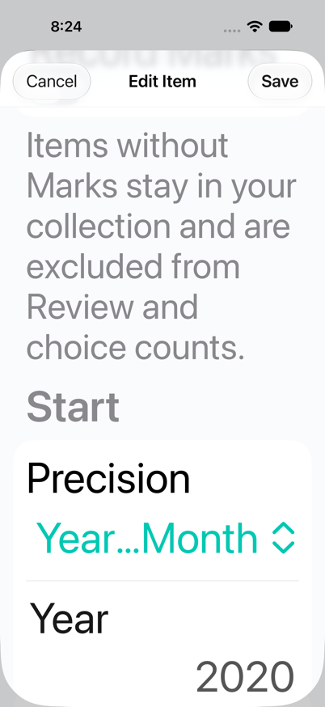 | 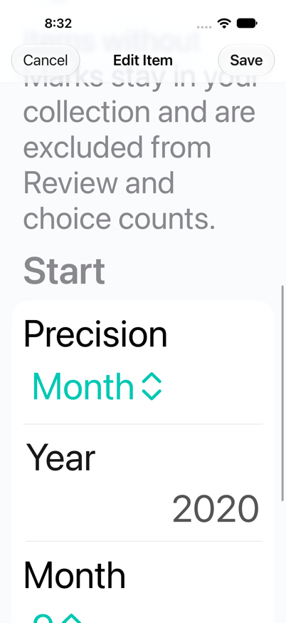 |

The final Xcode-native build passed with zero errors and extracted Stally
App Intents metadata. Formatter, SwiftLint, repository boundary checks, and
the six-catalog English/Japanese audit passed. The three obsolete UI labels
were the only removed keys; the existing `Actions` stale marker and intentional
product-name source copies remain. All original V1 fixture checksums still
match, including the disk stores, external photo, backup, and links.

No domain behavior changed, so the earlier 143 library, 115 original-reader,
and three app-adapter tests were not rerun or counted as new evidence for this
presentation correction. The native runtime interactions above are additional
evidence; they do not replace the original migration/backup tests.

### Insights Readability Correction

The mixed-scope check exposed a second presentation defect at standard English
text size: the supporting cards truncated `Collection Health`, `Current Streak`,
`Note coverage`, and a repeating-decimal percentage. The app now formats note
and photo percentages with at most one fractional digit and allows the card
header to take its required vertical height. The existing MHUI grid, native
scrolling, coverage counts, and choice calculations are unchanged. The correction
is committed as `a9c61e6`.

| Standard English before | Standard English after |
| --- | --- |
| 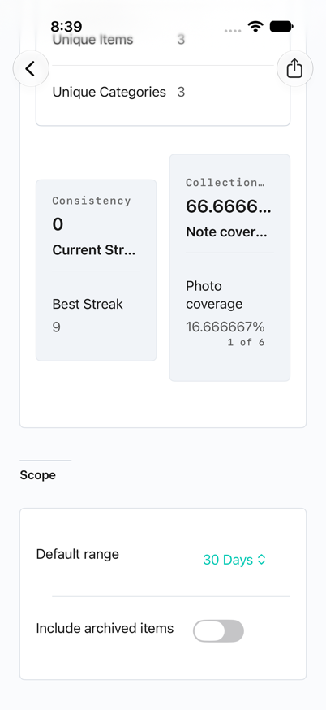 | 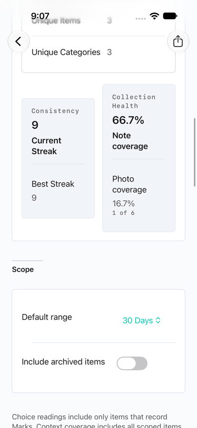 |

Both captures use six active items with Daily Field Notes set to non-Mark.
Note coverage is four of six, now displayed as `66.7%`; photo coverage is one
of six, now `16.7%`. The
[maximum-text capture](ui-preview-screenshots/item-tracking-continuation/insights-coverage-maximum-text-after.png)
follows actual scrolling through the single-column layout and retains the
percentage and count. Freshly launched preview data crossed the UTC date
boundary between runs: the later 30-day choice snapshot reads 16 Marks and
14 active days, compared with the earlier 15/13. This is a different time-based
seed, not evidence of a changed aggregation rule; coverage denominators match.

The [Japanese standard-size capture](ui-preview-screenshots/item-tracking-continuation/insights-coverage-ja-after.png)
and [Japanese maximum-size capture](ui-preview-screenshots/item-tracking-continuation/insights-coverage-maximum-text-ja-after.png)
also show complete localized headings and the same coverage values after actual
scrolling. The final native build passed with zero errors and Stally App Intents
metadata extraction. Formatter and repository rules passed for the three-file
presentation correction.

### File-Flow Evidence Boundary

The v2 UI input was a byte-identical disposable copy of the frozen backup.
Two explicitly synthetic v3 wire inputs retained its IDs, photos, notes, and
history. One changed only the unmarked Fixture 3 to non-Mark with a `2020-02`
start; the other enabled Marks and added one uniquely identified synthetic
Mark to that item. Provenance, assertions, and checksums are retained locally.
The files were downloaded through actual Simulator Safari and selected in Files
while the same in-memory Stally process remained alive. The loopback-only
server exposed only these disposable files and was stopped after download.

These inputs verify the native importer, mode-specific preview, confirmation,
and conflict behavior. They are not app-generated exports. Export opened the
native On My iPhone Save panel, but its remote hierarchy omitted Save, filename,
and location controls and supplied a misleading Cancel hit point. A fresh
session did not repair that hierarchy, and desktop Simulator access timed out
with `-10005`. No screenshot-only tap was substituted for the missing control.
Saving an actual v3 export and selecting that same saved file remains unverified
at the system UI boundary; library export-to-restore tests remain separate.

### Runtime and Cleanup

Retained app-process logs contain `model_container.preview_created` and
`startup.ready` for the import session and both final English/Japanese Insights
launches. The scoped review found no app fatal, exception, CloudKit, or
ModelContainer failure. The logs include Simulator/service diagnostics; this
is not a warning-free claim. The native tool's empty per-action log files were
not substituted for app runtime evidence.

The interaction session and app were stopped. The dedicated Simulator returned
to `large`, light appearance, and disabled Increase Contrast, then shut down.
Xcode's original `Stally` scheme was restored first; its destinations were
rediscovered and `Stally MHPlatform 1.13 Audit` was restored and read back.
No device was erased, no original fixture was changed, and no physical device,
real collection, cloud account, signing configuration, or public setting was
modified. Raw screenshots/hierarchies, the session ledger, native build logs,
and app logs remain in ignored `.build/ci/item-tracking-continuation-20260914/`.
Curated unedited screen comparisons are retained above.

### Remaining Manual Evidence

| Pending check | Reason and next step |
| --- | --- |
| Actual exporter Save and exported-v3 round trip | The system exporter hierarchy is incomplete. Use the safe setup below, save to On My iPhone through the visible native panel, then select that exact file and complete the cancellation/merge/replacement cases |
| VoiceOver speech, focus, and activation | Simulator hierarchy evidence is insufficient. Use a separately authorized isolated physical device and the concrete VoiceOver sequence below |
| Siri/Shortcuts UI | Current code-level adapter evidence does not prove system presentation or dependency injection. Establish that the system uses the same explicit in-memory session before running the steps below; stop on a cold normal launch |
| Local-midnight foreground refresh | The elapsed-day tests cover calendar behavior, but no detail stayed open across local midnight in this run. Keep the isolated exact-day detail open across local midnight and follow the foreground/time-refresh case below |
| Other sizes and orientations | This targeted interaction run covers portrait iPhone 18 Pro only. Repeat the affected forms/detail flows on the intended remaining device sizes before distribution |

## Interaction Procedures and Remaining Checks

The procedures below remain reproducible. The dated continuation above records
completed cases; checks without a completed observation remain unverified.
Use a separate iOS 27 Simulator with no account sign-in and the existing Debug
in-memory scenarios.
Keep the original V1 fixture directory read-only. Never perform this checklist
against a normal launch, real collection, cloud container, or distribution
build. Stopping the preview process discards its synthetic edits.

### Safe Setup

Build the Debug `Stally` scheme for a dedicated iOS 27 Simulator. Discover its
UDID, set `AUDIT_SIMULATOR_UDID` to that value, and use it in every command,
rather than `booted`. Install the resulting Debug app using Xcode or
`simctl install`, then launch:

```sh
xcrun simctl launch --terminate-running-process "$AUDIT_SIMULATOR_UDID" \
  com.muhiro12.Stally \
  --stally-preview-scenario integration \
  --stally-preview-route library
```

Verify `model_container.preview_created` in the app log and the synthetic Home,
Window Plant, and ordinary choice items in Library. Stop if either check fails.
Use the normal Library navigation for save/cancel round trips, keeping the
process alive throughout. The direct `editYear`/`editMonth` hosts are useful for
layout inspection but do not prove presentation and dismissal from Library.
Record before/after values, screenshots, and accessibility observations for each
case; do not infer completion from an enabled button.

### Interaction Matrix

| Check | Steps in the isolated in-memory app | Required observation |
| --- | --- | --- |
| Add and cancel | Open Add Item; type a unique synthetic name, disable Record Marks, select Year Only and enter `2020`; cancel. Reopen Add, repeat, and tap Add | Cancel leaves the collection unchanged and the new form at its defaults; Add creates exactly one item with year-only start and no Mark controls |
| Edit and cancel | Open Home from Library and Edit Item; change name/start/Mark policy, then Cancel. Reopen Edit, make one valid change, Save, and reopen detail/edit | Cancel preserves all original values; Save changes only the chosen fields and retains item identity, existing note/photo, and navigation |
| Precision refinement | In Home's editor change Year Only to Month, then Exact Day without filling new components | No month/day is inferred; Save stays disabled until each required component is explicitly selected |
| Calendar validation | Select exact `2020-02-29`; change year to `2021`, then choose a valid day. Try an empty year and a start later than today | The invalid day is cleared; incomplete input cannot save; a future start shows the localized error without changing the Item |
| Precision reduction | From a complete exact date select Year Only, then Exact Day again; finally select Not Set and save | Removed month/day components are not restored automatically; Not Set clears only the start and elapsed reading |
| Mark eligibility | On an unmarked synthetic item disable Marks and save; inspect detail, Library, Review, and Insights. Re-enable, Mark Today, and reopen Edit | Non-Mark controls/count prompts disappear; an item with history cannot disable Marks and has an explanatory footer; existing Marks remain |
| Archive and restore | Open Archived Plant; note its exact start and elapsed days. Move Back, archive again, and reopen it from Archive | Start/elapsed stay unchanged across those actions and Mark controls remain absent; Archive changes collection visibility only |
| Foreground/time refresh | Keep the same exact-day item across local midnight, background and foreground the app, then reopen detail | Elapsed days refresh without resetting at Archive or creating a Mark; do not change the host clock to simulate this |
| Backup cancellation and v3 | Export to a local Files folder; cancel once and confirm collection values. Choose the saved v3 file, inspect Merge, change to Replace, open each confirmation and cancel | Preview and enabled action match the selected method; Cancel changes no records; Replace is visibly destructive and separately confirmed |
| Old backup and conflict | Import a disposable copy of the original v2 fixture with Replace in the synthetic container; verify four fixture items. Export a v3 copy, edit an unmarked fixture to non-Mark, and export that state. Restore the first v3 copy, add one Mark to that same fixture item, and export the marked copy. Restore the non-Mark copy, then select the marked copy | Merge reports the policy conflict and cannot apply it; Replace has its own valid preview. Cancelling keeps the non-Mark item unchanged. Confirming Replace only in this synthetic container restores the marked copy |

For the v2 case, copy
`StallyLibrary/Tests/Default/Fixtures/V1/backup-v2.stallybackup` to a disposable
local directory. If it is not reachable from Simulator Files,
serve only that directory with a loopback-only local HTTP server, download the
copy in Simulator Safari, and select it from Files Downloads. Do not sign in to
iCloud or expose the repository, original store, or private files through the
server. Stop the server after the check. Keep both synthetic v3 exports outside
the repository and never overwrite the original v2 file.

For example, from the repository root, prepare only the disposable backup copy:

```sh
AUDIT_FIXTURE_DIRECTORY="$(mktemp -d /tmp/stally-backup-ui.XXXXXX)"
cp StallyLibrary/Tests/Default/Fixtures/V1/backup-v2.stallybackup \
  "$AUDIT_FIXTURE_DIRECTORY/"
python3 - "$AUDIT_FIXTURE_DIRECTORY" <<'PY'
from functools import partial
from http.server import SimpleHTTPRequestHandler, ThreadingHTTPServer
import sys


class BackupHandler(SimpleHTTPRequestHandler):
    def guess_type(self, path):
        if path.endswith('.stallybackup'):
            return 'application/octet-stream'
        return super().guess_type(path)

    def end_headers(self):
        if self.path.split('?')[0] == '/backup-v2.stallybackup':
            self.send_header(
                'Content-Disposition',
                'attachment; filename="backup-v2.stallybackup"'
            )
            self.send_header('Cache-Control', 'no-store')
        super().end_headers()


server = ThreadingHTTPServer(
    ('127.0.0.1', 8765),
    partial(BackupHandler, directory=sys.argv[1])
)
server.serve_forever()
PY
```

In Simulator Safari, open `http://127.0.0.1:8765/backup-v2.stallybackup` and
download it. The attachment headers matter: the default Python server rendered
the JSON inline during this audit. If that port is already in use, choose
another unused port for both the server and URL. Stop this foreground server
with Control-C when done.

### Accessibility and System Surfaces

Apple's [accessibility testing guidance][accessibility-testing] distinguishes
visual settings from actual assistive-technology operation. It explicitly
requires a physical device for VoiceOver; a Simulator hierarchy or screenshot
does not verify spoken output, focus navigation, or activation.

1. On the dedicated Simulator, inspect the Accessibility Inspector hierarchy
   for Add/Edit and detail. Confirm localized names, roles, and current values
   for Record Marks, Precision, Year, Month, Day, Cancel, Add/Save, Edit Item,
   and the start/elapsed rows. Check that disabled Save and the history-locked
   toggle expose their disabled state. Inspect both English and Japanese.
2. Repeat the interaction matrix at the largest accessibility text size. Scroll
   every form and detail section; open the precision/month/day menus and
   keyboard. Verify that values, validation text, photo controls, and toolbar
   actions remain readable and reachable without overlap. Check light/dark
   appearance and Increase Contrast. An initial viewport alone cannot pass this.
3. For actual VoiceOver, use a separately authorized isolated physical device
   with synthetic data and no cloud writes. Enable VoiceOver in Settings >
   Accessibility, then navigate the form and detail using next/previous focus
   and activation gestures. Confirm label/value/role, focus order, Save/Cancel
   completion, validation announcements, and absence of Mark actions on a
   non-Mark item. Record spoken output as well as the result. This device step
   is outside the current Simulator-only task.
4. For Shortcuts/Siri UI, first establish that the running Debug app and its
   dependency container remain the same in-memory session. If the system
   cold-launches without preview arguments, stop; do not fall back to a normal
   persistent/cloud launch. In a supported session, inspect Mark Today choices,
   save a shortcut for a never-marked item, then disable its Mark policy in the
   app and run that saved shortcut. Expect a localized refusal and no history
   mutation. Re-enable and check Mark/dedup and app-side Undo. Generic entity
   identity and hidden Open/Undo Intents already have code-level evidence;
   hidden actions are not expected to appear in the new-action browser.
5. Under the same isolated-session prerequisite, add Check Time Together in
   Shortcuts, select Home or Window Plant, and inspect the English/Japanese
   parameter summary and returned text. Compare the start precision, elapsed
   value, and reading day with Item Detail. Repeat for Archived Plant and an
   unknown-start item; verify the Archive note and absence of invented dates.
   Save the shortcut, remove only its synthetic item, and expect the localized
   missing-item error on the next run. Verify the authentication requirement
   before reading from a locked device. Code-level probes do not establish any
   of these system presentation or authentication outcomes.

For the follow-up surfaces, include Start row metadata, Refine's two new filters
and start sorts, Yearly Milestone, and Share Time Together in the VoiceOver and
device-size sequence. Confirm that approximate milestones announce only the
known month/year, the explanatory footer remains reachable, and the native
share sheet can be dismissed without sending or copying the report. Check dark
appearance and Increase Contrast separately; the follow-up's light portrait
captures do not extend the earlier appearance evidence to the new controls.

Stop the audit app and restore Simulator accessibility settings and the original
Xcode scheme/destination after manual verification. Do not erase other devices.

[accessibility-testing]: https://developer.apple.com/documentation/accessibility/performing-accessibility-testing-for-your-app

## Separate Pre-Distribution Checks

The September 14 read-only refresh is recorded in
[release-readiness.md](release-readiness.md). Distribution gates remain separate:

| Required decision or evidence | Concrete alternatives / next check |
| --- | --- |
| Ads and subscription offer | The accepted direction is native ads with monthly ad removal; prepare Stally-owned IDs before publication when possible and handle post-publication readiness separately. If initial setup is blocked, defer ads and ad-removal sales together without changing the long-term offer |
| Privacy and Support | Stally GitHub Pages and GitHub Issues are approved destinations. The page sources and Settings Support link are prepared locally; publication and successful live-page verification remain separate |
| Signing and distribution | Supply the distribution certificate/private key and provisioning profile; export and inspect the shipping build |
| Devices and CloudKit | Select synthetic test accounts/devices/environment before cloud writes; verify upgraded-device sync, offline/concurrent edits, repair, relaunch, and schema promotion |
| Store/runtime acceptance | Verify purchase/restore and the distributed build; complete the interaction/accessibility checks listed above |

Mixed old/new CloudKit writers and production schema promotion remain outside
the verified rollout. These gates do not reopen the accepted Item/Mark/Archive
semantics or require a Fluel migration.
