# MHUI Adoption and UI Capture Report

## Purpose

This report records Stally's current MHUI adoption through version 1.17.0 and
preserves the major-screen captures used to review the result.

The current review date is July 23, 2026.

## Outcome

The package update and the adoption advice are implemented.

- Item Detail, Insights, and Backup Center now use MHUI signature composition.
- Library, Archive, Review, Settings, and item editors retain native
  `List` or `Form` bridges where platform behavior is part of the screen.
- Native navigation, sheets, file import and export, sharing, TipKit, alerts,
  and confirmation dialogs remain intact.
- Insights now leads with the complete MHUI hierarchy: screen title, editorial
  summary, semantic feature surfaces, then native scope and report controls.
- Enabled primary, secondary, and destructive actions remain visually distinct
  from disabled actions inside `MHActionGroup`.
- The host app still owns the Mint accent through `AccentColor`.
- English and Japanese localization remain complete for the changed surface.
- The main iPhone gallery, targeted accessibility variants, and regular-width
  iPad evidence were refreshed from the rebuilt app.

The current MHUI follow-through is split into these commits:

- `3567b88` updates MHUI to 1.16.0.
- `f2dc247` adopts the adaptive Insights feature hierarchy.
- `29acb19` makes that hierarchy visible as the primary Insights composition.
- `8b6a7dc` updates MHUI to 1.17.0 and adopts its action contrast restoration.

## Adoption policy

Stally chooses its MHUI integration by screen purpose instead of applying one
container style everywhere.

Signature composition is used for read-only detail, report, and focused tool
screens:

- `mhScreen` owns the scrolling canvas, readable width, margins, and vertical
  section rhythm.
- `MHSummary` provides an editorial lead when a screen has a representative
  state or metric.
- `MHFeatureGrid` preserves one primary feature and a concise supporting set
  across available widths and Dynamic Type sizes.
- `MHGroupedRows` presents compact related values without nesting a `List`.
- `MHActionGroup` makes primary, secondary, and destructive actions explicit.
- `mhSection` provides consistent section hierarchy and separation.

Native bridges remain the correct choice for interaction-heavy collection and
editor screens:

- Library and Archive retain search, row navigation, and collection behavior.
- Review retains native selection, editing, and multi-selection behavior.
- Settings retains native controls and preferences.
- Add Item, Edit Item, and Adjust History retain native form semantics.

This preserves the behavior expected from Apple lists and forms while using
MHUI for the screens where custom composition adds meaningful hierarchy.

## Implemented changes

### Item Detail

- Replaced the list container with `mhScreen`.
- Kept the item name as the native navigation title.
- Changed the summary lead to item status so it does not duplicate the title.
- Promoted the item photo to a dedicated `mhSection`.
- Grouped Mark Today, Undo, and Adjust History in `MHActionGroup`.
- Converted History, Quiet History, Overview, Archive, and Delete areas to
  MHUI sections and grouped rows.
- Kept edit, share, TipKit, sheets, and confirmation dialogs native.

### Insights

- Replaced the list container with `mhScreen`.
- Moved Insights into the MHUI screen title and subtitle hierarchy instead of
  repeating a native navigation title.
- Made the selected range the `MHSummary` context and total marks an accent
  badge.
- Added app-owned Activity, Consistency, and Collection Health feature tiles
  using MHUI typography, insets, key-value rows, and semantic surface roles.
- Positioned the feature hierarchy before controls so the first viewport
  communicates the screen's purpose.
- Converted scope controls and report sharing to compact MHUI groups.
- Promoted Activity as the primary reading and grouped Consistency with
  Collection Health as concise supporting readings through `MHFeatureGrid`.
- Converted Activity, Consistency, Rhythm, Categories, rankings, collection
  health, and recommendations to signature sections.
- Kept item navigation and `ShareLink` native.
- Kept the advertisement as product-owned content outside MHUI abstractions.

### Backup Center

- Replaced the list container with `mhScreen`.
- Made the current backup snapshot a leading key-value group.
- Separated Export and Import into focused action sections.
- Promoted Export Backup as the safe primary action.
- Moved a loaded backup into an independent Backup Preview section.
- Shows validation results before merge and replace actions.
- Keeps Delete Every Item as the final destructive section.
- Kept file import, file export, TipKit, alerts, and destructive confirmation
  dialogs native.

## Adopted MHUI surface

The changed screens now use:

- `MHTheme.standard` and `MHGlassPolicy.automatic` at the app root.
- `mhScreen` for Item Detail, Insights, and Backup Center.
- `MHSummary` for Item Detail and Insights.
- `MHFeatureGrid` for the adaptive Insights reading hierarchy.
- `MHGroupedRows` for details, metrics, history, validation, and status.
- `MHActionGroup` for focused safe and destructive action clusters.
- `mhSection` for signature section hierarchy.
- `MHKeyValueLabeledContentStyle.mhKeyValue` for compact value reading.
- Existing MHUI typography, badge, empty-state, row, and button styles.

Stally does not add a custom theme, fixed RGB palette, separate MHDesign link,
or MHUI dependency to `StallyLibrary`.

## Root-first styling and asset ownership follow-up

The July 23 package review confirms that Stally already has the preferred
root shape:

```swift
rootContent
    .stallyPlatformEnvironment(platformEnvironment)
    .mhTheme(.standard)
    .mhGlassPolicy(.automatic)
```

`mhTheme(_:)` is the canonical root-first styling entry point. It propagates
the complete theme, synchronizes the underlying MHDesign metrics, and carries
the app-owned `AccentColor` into the ordinary native tint path. Stally should
not add a blanket root button, font, foreground, list, or form style; those
styles would cross toolbar, menu, and system-presentation boundaries where the
root cannot infer semantic intent.

The current captures show that this is not a conservative, theme-only
adoption. Item Detail, Insights, and Backup Center visibly use the MHUI
signature through editorial rules, section cues, outlined grouped rows, and
measured whitespace. Library, Archive, Review, Settings, and editors remain
native routes for concrete collection, selection, preference, and input
behavior. Their native containers are deliberate exceptions rather than the
dominant design direction.

MHUI 1.17 is now resolved. It preserves the semantic color adoption and
adaptive feature hierarchy from 1.16 while restoring enabled label and symbol
contrast inside Liquid Glass action groups. Stally does not add a local
foreground override or disable Glass for these controls; the package-owned
action styles remain the presentation authority. Stally continues to use the
package's semantic color modifiers for the remaining product-source color
exceptions:

1. `View+StallyPresentationChrome.swift` applies
   `.mhTint(.primaryText)` where toolbar actions intentionally use a neutral
   theme color.
2. `ItemPhotoFeedback.swift` applies
   `.mhForegroundStyle(.destructive)` and
   `.mhForegroundStyle(.secondaryText)` to feedback content.
3. `ItemCollectionRefinementSection.swift` resolves its secondary count
   through the MHUI secondary text role.
4. `QuietHistoryDayCell.swift` resolves marked and unmarked circles through
   `.accent` and `.secondaryText`, keeping opacity as a code-derived treatment.

These changes keep concrete color values in MHUI or app asset catalogs while
letting source express semantic intent. The `CGColor(red:...)` values in
`StallyLibrary` test photo fixtures are generated image-processing inputs, not
shipping presentation colors. The screenshot JPEGs under `docs` are review
artifacts, not runtime app resources.

## Capture environment

- App configuration: Debug.
- Xcode: 27.0 beta, build `27A5228h`.
- iPhone: iPhone 17 Pro for Stally, iOS 27 Simulator.
- iPad: iPad Pro 11-inch (M5) for Stally, iOS 27 Simulator.
- Main gallery locale: Japanese app localization with deterministic preview
  item data.
- Phone artifacts: 368 by 800 JPEG.
- iPad artifacts: 827 by 1200 JPEG.
- Source: DEBUG preview scenarios and launch routes.
- Simulator application data was not erased.

## Major iPhone screens

### Library

Empty state:

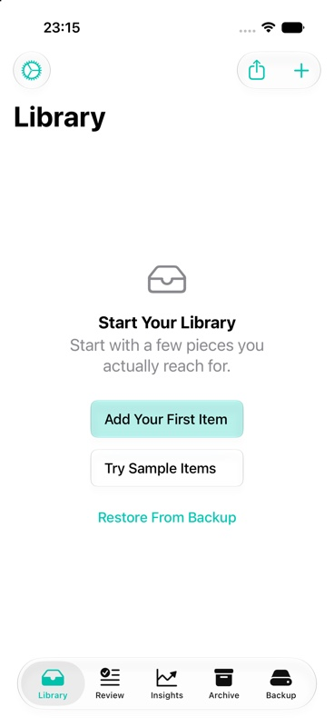

Dense collection:

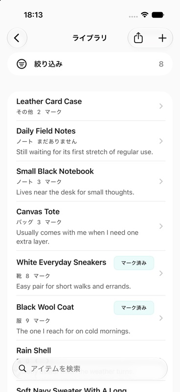

### Item Detail

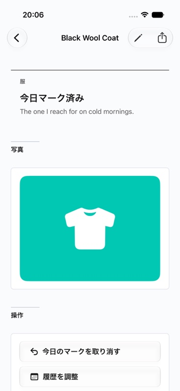

### Archive

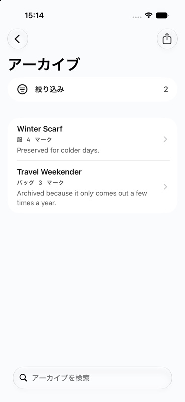

### Review

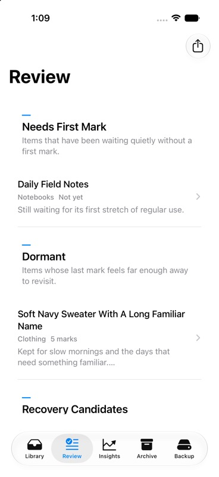

### Insights

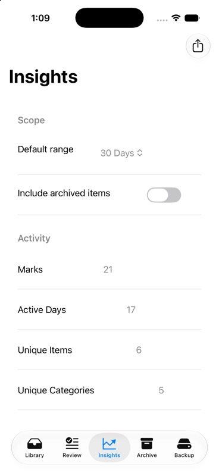

### Backup Center

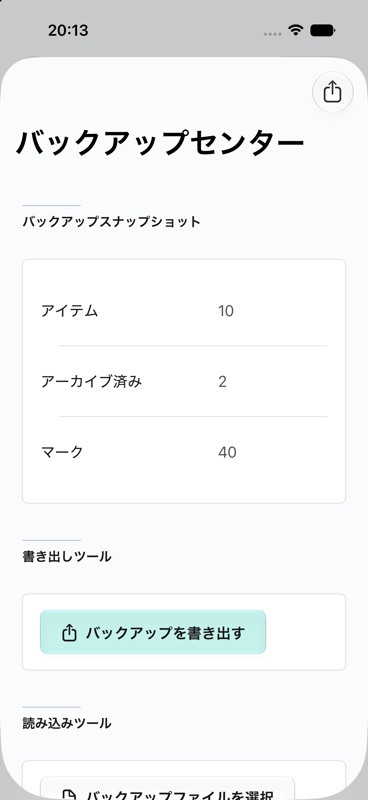

### Settings

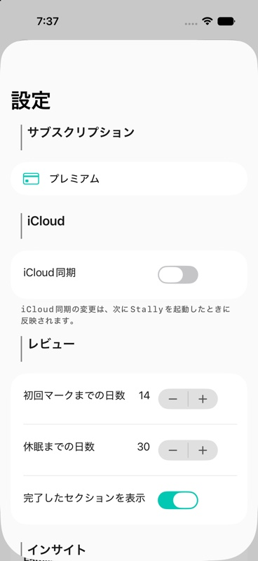

### Add Item

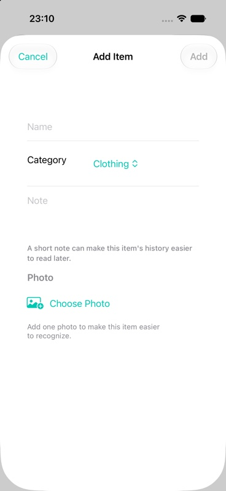

## Regular-width iPad screens

The iPad captures confirm that the split-view sidebar remains native while
signature screens use a constrained readable content width. Insights uses the
regular-width `MHFeatureGrid` split: the elevated Activity feature leads, with
the two muted supporting features beneath it.

### Library

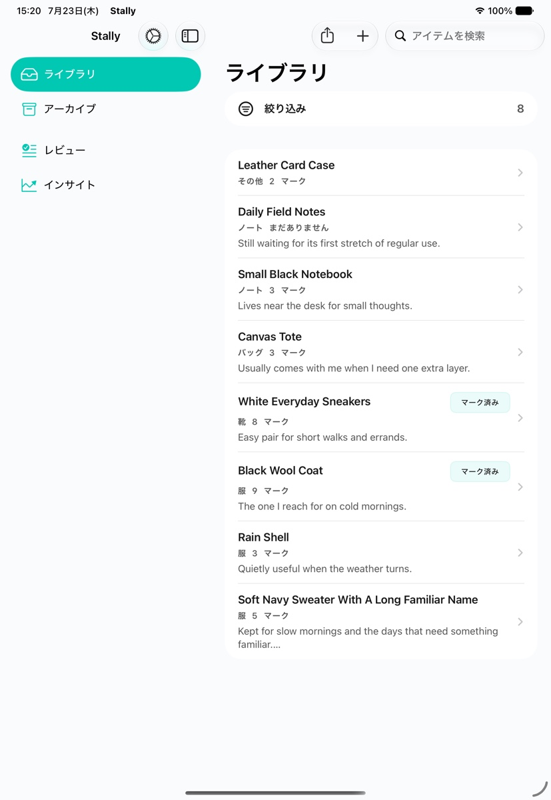

### Item Detail

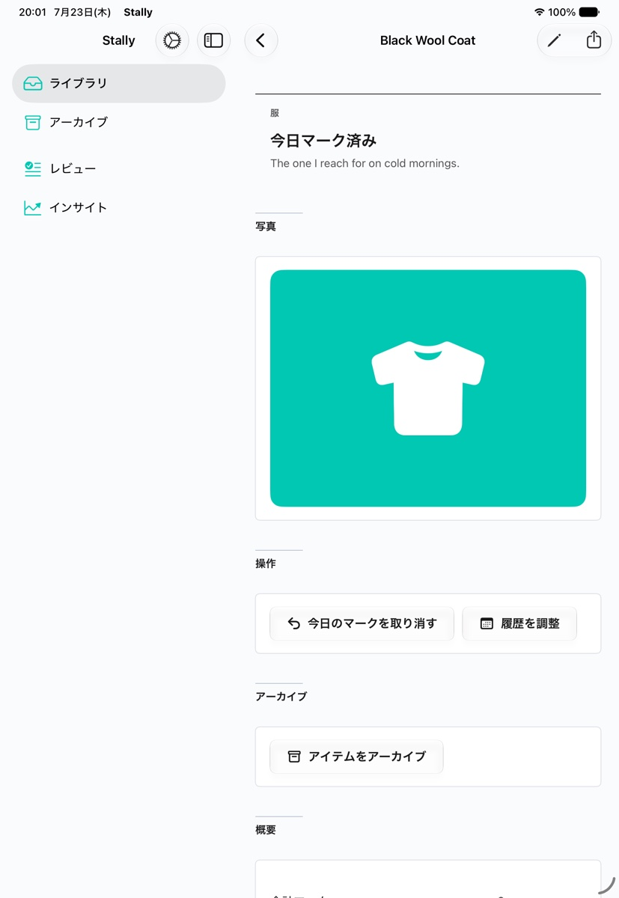

### Insights

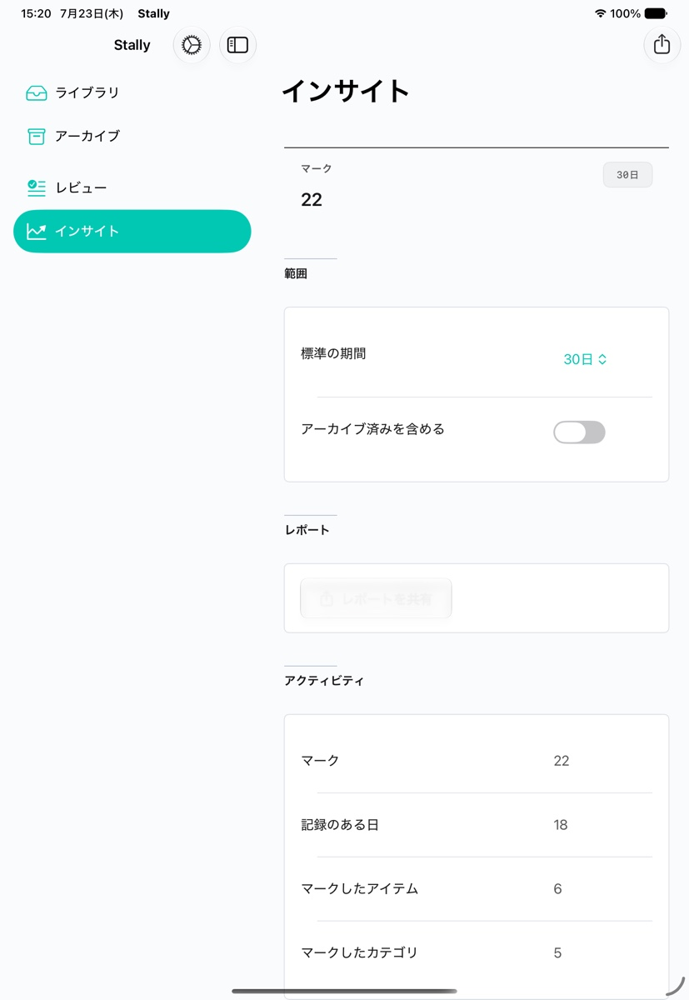

## Targeted adaptive evidence

### Insights feature hierarchy

The regular-width capture isolates the app-owned feature content that MHUI
arranges. Activity remains primary, while Consistency and Collection Health
form a concise supporting pair and stay readable in Japanese.

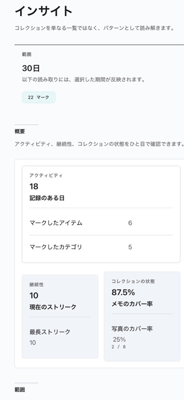

### Insights in Dark Mode

Semantic text, group borders, controls, and the Mint accent remain legible.

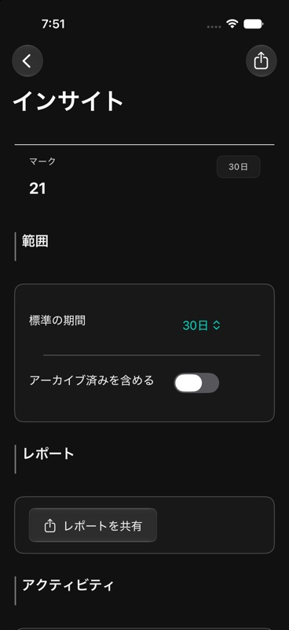

### Item Detail with accessibility text

The summary and section hierarchy reflow at
`accessibility-extra-large` without truncating the first viewport.

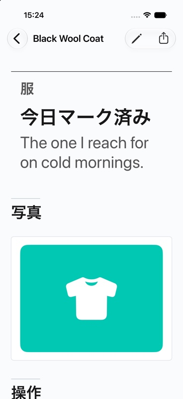

### Backup Center with increased contrast

Grouped boundaries and action hierarchy remain visible with Increase Contrast
enabled.

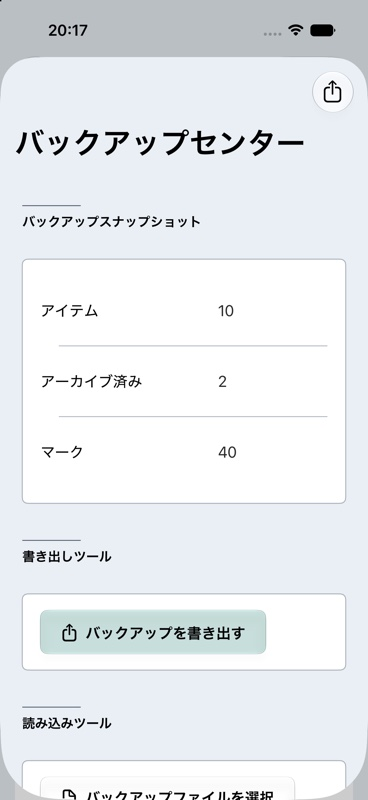

### Library in forced right-to-left layout

Navigation controls and leading alignment mirror correctly. English is
expected here because Arabic is not a supported Stally localization.

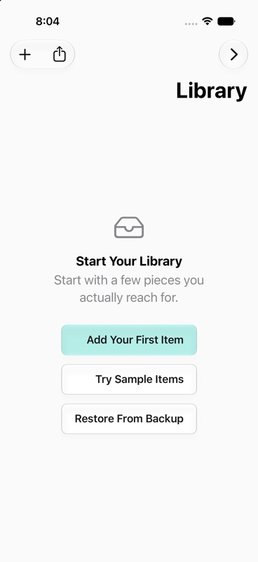

The iPhone Simulator was restored to Light appearance, standard Large content
size, and normal contrast after these captures.

## Review findings

No blocking visual issue was found in the captured first viewports.

- Signature screens have one clear navigation heading and do not repeat it in
  `MHSummary`.
- Grouped rows read as one related surface without nested list chrome.
- Item Detail keeps its photo and Mark Today action prominent without turning
  the screen into a dashboard.
- Enabled Mark, history, archive, export, and destructive actions no longer
  resemble disabled controls when composed inside `MHActionGroup`.
- Insights presents its purpose, range summary, primary readings, scope, and
  report in a stable editorial order. Activity stays primary while
  Consistency and Collection Health reflow as supporting content.
- Backup Center separates safe, import, and destructive tasks clearly.
- Native collection, selection, editor, and system-presentation behavior is
  unchanged.
- iPad uses a readable detail width while preserving the system split view.
- Dark Mode, accessibility text, increased contrast, and forced RTL do not
  introduce clipping or misplaced controls in the captured states.

## Verification boundary

Runtime captures verify layout and presentation of the stable first viewport.
They do not by themselves prove:

- destructive confirmation completion;
- runtime file importer interaction with an external backup document;
- real-device CloudKit synchronization;
- production StoreKit resolution;
- production AdMob serving.

Backup import validation remains represented by the dedicated
`Backup Center - Import Preview` SwiftUI preview and by the compiled
`BackupImportPreviewSection`. Destructive actions remain behind native
confirmation dialogs and were not executed for this visual audit.

The updated action surfaces were captured from live iPhone and iPad Simulator
launches. MHUI's dedicated action contrast regression Preview was also rendered
in Light and Dark appearances. Xcode Device Interaction did not establish a
workspace-backed session, so the already-built app was installed directly and
verified through a bounded non-workspace session instead. That session captured
the Item Detail hierarchy before and after scrolling, confirmed enabled
44.3-point action controls without truncation or overlap, and was then stopped.

The repository build, library tests, repository rules, string-catalog audit,
and runtime-log review are recorded in the task handoff alongside this report.
