# MHUI Adoption and UI Capture Report

## Purpose

This report preserves the major-screen captures from Stally's MHUI adoption
through version 1.17.0 and subsequent targeted runtime checks.

The initial review date is July 23, 2026. Later checks are dated separately.

The September 13 optional-start integration has a separate
[screen comparison and coverage ledger](item-tracking-verification.md), including
actual Simulator captures, native Preview/session failures, and adapter checks.
Its subsequent isolated interaction audit records one precision-Picker layout
correction, Dynamic Type/appearance comparisons, and explicit manual checks
where runtime operation or accessibility tools could not connect.

## Current MHUI 1.19 Adoption

The September 15 update adopts the published [MHUI 1.19 release][mhui-1-19],
revision `81f48d1784ad85aadf4fccdf1e4e85606ac5c142`. Only the app's MHUI
lockfile entry changes from 1.18.0 to 1.19.0; all other dependency pins remain
unchanged. Xcode's resolved MHUI checkout matches the release revision.

### SDK Changes and App Integration

The release removes decorative screen and section heading cues and the
summary's top rule. It introduces low-chroma content colors, softer heading
and metadata typography, quieter dividers and surface borders, and slightly
slower standard motion. `MHDesign` metrics and package dependencies do not
change between these revisions.

Stally inherits these changes through its existing root `mhTheme(.standard)`.
It has no references to the removed `MHCuePlacement`, `screenCue*`, or
`sectionCue*` APIs and no custom `MHTheme.Presentation` to migrate.

- Library, Archive, Review, Settings, and Item Detail retain native `List`
  composition; item editors retain native `Form` composition.
- Insights and Backup Center keep their deliberate stack-based composition.
  SDK-owned headings, summaries, and surface boundaries adopt the new
  treatment without app-local replacements for the removed decoration.
- The Divider inside each Insights feature tile separates its leading metric
  from supporting readings. It remains a content boundary rather than a
  decorative heading cue.
- The app-owned Mint accent and semantic action styles remain in place.
  Item Detail keeps its bottom `safeAreaBar` inside `mhListChrome`'s layout
  scope. Glass remains on interactive controls; content surfaces use the
  package's standard opaque roles.

No app-source adjustment is needed for the removed API or theme changes.
The integration follows the release's
[adoption guide][mhui-1-19-adoption] and Apple's
[Liquid Glass guidance][apple-liquid-glass] for native controls and navigation.

### September 15 Verification

The dependency update is committed as `e43c627`. Both comparison builds use
Xcode 27.0 (`27A266a`), the Stally scheme, and the iOS 27 Simulator. The
Xcode-native build with MHUI 1.19 succeeds with no warnings or errors and
extracts Stally's App Intents metadata. Repository rules pass, including the
project-managed SwiftLint and app/library boundary checks.

These are presentation-only dependency changes. `StallyLibrary` source,
persistence, backup formats, and its dependency graph are unchanged; library
tests are not repeated for this update.

The comparison uses the existing Debug `typical` in-memory fixture on an
iPhone 18 Pro in portrait, at the default Large content-size category, with
English, Light appearance, and Increase Contrast disabled. It compares
published MHUI 1.18.0 against 1.19.0 with identical app source and launch
arguments. Startup logs confirm the preview model container and ready state.

| Screen | Before | After |
| --- | --- | --- |
| Insights | [1.18][119-insights-before] | [1.19][119-insights-after] |
| Item Detail | [1.18][119-detail-before] | [1.19][119-detail-after] |
| Add Item | [1.18][119-add-before] | [1.19][119-add-after] |

Insights loses its decorative heading rules and adopts softer typography and
surface boundaries. Item Detail retains its native grouping and floating
action layout. Add Item keeps its native fields, selected Record Marks toggle,
and disabled Add action. No clipping or overlap is observed in these captured
viewports.

Native hierarchy-based taps also confirm that Edit Item opens a populated
[editor sheet][119-editor] and Cancel returns to the unchanged detail. Undo
Today's Mark changes the item to Not marked and shows the Mint
[Mark Today action][119-mark]; tapping it restores Marked Today and the
original mark count. These operations affect only the in-memory fixture.

Additional default-size captures cover [Library][119-library],
[Backup Center][119-backup], and [Settings][119-settings]. Library's rows and
semantic badges remain readable. Backup's snapshot, Export, and Import groups
remain distinct after dismissing a transient TipKit hint. Settings preserves
the visible native toggles and steppers.

Settings also retains the empty subscription-product container observed in
the earlier platform audit. The log reports that the subscription store has
no auto-renewable subscription to show. The app's StoreKit adapter and package
pin are unchanged; this capture does not resolve that product-availability
limitation or verify purchase and restore behavior.

At Japanese Accessibility Extra Extra Extra Large (AX5), Insights keeps its
[heading and summary][119-insights-ax5] readable and its
[metric labels and values][119-metrics-ax5] vertically wrapped. Native swipes
confirm that the content remains scrollable.

Item Detail's [Japanese AX5 actions][119-detail-ax5] also wrap completely.
The two floating actions occupy about 373 points of the 874-point screen,
leaving a short reading viewport; [scrolling still works][119-detail-scroll].
Action typography and padding are unchanged by this update. Attribution to
1.19 remains unverified because this pass has no matching 1.18 AX5 capture.

English [Insights][119-insights-dark] and [Item Detail][119-detail-dark] were
also inspected in Dark appearance with Increase Contrast enabled and Large
text. Text hierarchy, Mint controls, neutral actions, and surface boundaries
remain readable in the captured viewports.

This pass covers portrait iPhone presentation and the named interactions.
iPad, landscape, VoiceOver operation, Reduce Transparency, Reduce Motion, and
production service behavior are not verified here. Simulator logs contain
CoreTelephony, WebKit, and accessibility-runtime diagnostics; no Stally crash
or fatal startup failure was observed. The screenshots are implementation
evidence, not a golden visual baseline or distribution approval.

Verification runs were stopped and device sessions ended. Simulator
appearance, Increase Contrast, and content size were restored to Light,
disabled, and Large. Xcode's scheme was restored first, destinations were
rediscovered, and the final Stally / My Mac selection was confirmed.
Detailed build logs, runtime logs, hierarchies, and the environment ledger are
retained locally in the ignored `.build/ci/mhui-1.19/` directory.

[119-insights-before]: ui-preview-screenshots/mhui-1.19/before/insights-en-light-large.png
[119-insights-after]: ui-preview-screenshots/mhui-1.19/after/insights-en-light-large.png
[119-detail-before]: ui-preview-screenshots/mhui-1.19/before/item-detail-en-light-large.png
[119-detail-after]: ui-preview-screenshots/mhui-1.19/after/item-detail-en-light-large.png
[119-add-before]: ui-preview-screenshots/mhui-1.19/before/add-item-en-light-large.png
[119-add-after]: ui-preview-screenshots/mhui-1.19/after/add-item-en-light-large.png
[119-editor]: ui-preview-screenshots/mhui-1.19/after/item-detail-edit-open-en-light-large.png
[119-mark]: ui-preview-screenshots/mhui-1.19/after/item-detail-undo-en-light-large.png
[119-library]: ui-preview-screenshots/mhui-1.19/after/library-en-light-large.png
[119-backup]: ui-preview-screenshots/mhui-1.19/after/backup-clear-en-light-large.png
[119-settings]: ui-preview-screenshots/mhui-1.19/after/settings-en-light-large.png
[119-insights-ax5]: ui-preview-screenshots/mhui-1.19/after/insights-ja-light-ax5.png
[119-metrics-ax5]: ui-preview-screenshots/mhui-1.19/after/insights-ja-light-ax5-metrics.png
[119-detail-ax5]: ui-preview-screenshots/mhui-1.19/after/item-detail-ja-light-ax5.png
[119-detail-scroll]: ui-preview-screenshots/mhui-1.19/after/item-detail-ja-light-ax5-scrolled.png
[119-insights-dark]: ui-preview-screenshots/mhui-1.19/after/insights-en-dark-contrast-large.png
[119-detail-dark]: ui-preview-screenshots/mhui-1.19/after/item-detail-en-dark-contrast-large.png
[mhui-1-19]: https://github.com/muhiro12/MHUI/releases/tag/1.19
[mhui-1-19-adoption]: https://github.com/muhiro12/MHUI/blob/1.19/Designs/Guides/ADOPTION_GUIDE.md
[apple-liquid-glass]: https://developer.apple.com/documentation/TechnologyOverviews/adopting-liquid-glass

## September 13 MHUI 1.18 Adoption

The September 13 review confirms that the then-latest published
[MHUI 1.18 release][mhui-1-18] is already installed by `ea9b314`. The app's
lockfile and both verified build checkouts match the published revision
`5e9841f77b770184ea560cec4831adacc1e0fdb6`.

The release makes native `List` and `Form` composition complete adoption paths
alongside stack-based composition. Current Stally already follows that guidance:

- `3b5d353` composes Item Detail with native list sections. Its
  `scrollEdgeEffectStyle` and bottom `safeAreaBar` precede `mhListChrome`,
  keeping the reading surface and floating Mark/history actions in the same
  adaptive layout scope.
- `c337a60` preserves native item-editor fields and photo rows while keeping
  explicit destructive styling for Remove Photo. Native row treatment is
  selective; applying `mhRow` to every field is not required.
- Mark, history, and backup buttons use MHUI's semantic button styles. The
  release's capsule glass effect includes the padded label and disables glass
  interaction for disabled actions inside the package. Stally does not layer
  a competing glass effect or pressed-state workaround over those buttons.
- Insights retains its deliberate stack-based reading hierarchy. The release
  does not require moving every screen to one container style or changing
  app-owned theme tokens.

No further app-source migration is required for 1.18. The prior July 23 policy
and gallery below are historical; their stack-based Item Detail does not
describe the current native-list implementation.

The final Debug build and development-signed Release archive recorded in the
MHPlatform 1.13 check already included this exact MHUI revision and the current
app source. This review rechecked their resolved dependency state and found no
subsequent app, project, or library-source change. Builds and tests were not
repeated for this documentation-only reconciliation. The package release's
own visual validation does not substitute for Stally interaction evidence;
the capture and tool-access limits in the dated checks below still apply.

## July 23 Outcome

The package update and the adoption advice are implemented.

- Item Detail, Insights, and Backup Center now use MHUI signature composition.
- Library, Archive, Review, Settings, and item editors retain native
  `List` or `Form` bridges where platform behavior is part of the screen.
- Native navigation, sheets, file import and export, sharing, TipKit, alerts,
  and confirmation dialogs remain intact.
- Insights now leads with the complete MHUI hierarchy: screen title, editorial
  summary, semantic feature surfaces, then native scope and report controls.
- Enabled primary, secondary, and destructive actions remain visually distinct
  from disabled actions inside `MHActionGroup`.
- The host app still owns the Mint accent through `AccentColor`.
- English and Japanese localization remain complete for the changed surface.
- The main iPhone gallery, targeted accessibility variants, and regular-width
  iPad evidence were refreshed from the rebuilt app.

The current MHUI follow-through is split into these commits:

- `3567b88` updates MHUI to 1.16.0.
- `f2dc247` adopts the adaptive Insights feature hierarchy.
- `29acb19` makes that hierarchy visible as the primary Insights composition.
- `8b6a7dc` updates MHUI to 1.17.0 and adopts its action contrast restoration.

## Adoption policy

Stally chooses its MHUI integration by screen purpose instead of applying one
container style everywhere.

Signature composition is used for read-only detail, report, and focused tool
screens:

- `mhScreen` owns the scrolling canvas, readable width, margins, and vertical
  section rhythm.
- `MHSummary` provides an editorial lead when a screen has a representative
  state or metric.
- `MHFeatureGrid` preserves one primary feature and a concise supporting set
  across available widths and Dynamic Type sizes.
- `MHGroupedRows` presents compact related values without nesting a `List`.
- `MHActionGroup` makes primary, secondary, and destructive actions explicit.
- `mhSection` provides consistent section hierarchy and separation.

Native bridges remain the correct choice for interaction-heavy collection and
editor screens:

- Library and Archive retain search, row navigation, and collection behavior.
- Review retains native selection, editing, and multi-selection behavior.
- Settings retains native controls and preferences.
- Add Item, Edit Item, and Adjust History retain native form semantics.

This preserves the behavior expected from Apple lists and forms while using
MHUI for the screens where custom composition adds meaningful hierarchy.

## Implemented changes

### Item Detail

- Replaced the list container with `mhScreen`.
- Kept the item name as the native navigation title.
- Changed the summary lead to item status so it does not duplicate the title.
- Promoted the item photo to a dedicated `mhSection`.
- Grouped Mark Today, Undo, and Adjust History in `MHActionGroup`.
- Converted History, Quiet History, Overview, Archive, and Delete areas to
  MHUI sections and grouped rows.
- Kept edit, share, TipKit, sheets, and confirmation dialogs native.

### Insights

- Replaced the list container with `mhScreen`.
- Moved Insights into the MHUI screen title and subtitle hierarchy instead of
  repeating a native navigation title.
- Made the selected range the `MHSummary` context and total marks an accent
  badge.
- Added app-owned Activity, Consistency, and Collection Health feature tiles
  using MHUI typography, insets, key-value rows, and semantic surface roles.
- Positioned the feature hierarchy before controls so the first viewport
  communicates the screen's purpose.
- Converted scope controls and report sharing to compact MHUI groups.
- Promoted Activity as the primary reading and grouped Consistency with
  Collection Health as concise supporting readings through `MHFeatureGrid`.
- Converted Activity, Consistency, Rhythm, Categories, rankings, collection
  health, and recommendations to signature sections.
- Kept item navigation and `ShareLink` native.
- Kept the advertisement as product-owned content outside MHUI abstractions.

### Backup Center

- Replaced the list container with `mhScreen`.
- Made the current backup snapshot a leading key-value group.
- Separated Export and Import into focused action sections.
- Promoted Export Backup as the safe primary action.
- Moved a loaded backup into an independent Backup Preview section.
- Shows validation results before merge and replace actions.
- Keeps Delete Every Item as the final destructive section.
- Kept file import, file export, TipKit, alerts, and destructive confirmation
  dialogs native.

## Adopted MHUI surface

The changed screens now use:

- `MHTheme.standard` and `MHGlassPolicy.automatic` at the app root.
- `mhScreen` for Item Detail, Insights, and Backup Center.
- `MHSummary` for Item Detail and Insights.
- `MHFeatureGrid` for the adaptive Insights reading hierarchy.
- `MHGroupedRows` for details, metrics, history, validation, and status.
- `MHActionGroup` for focused safe and destructive action clusters.
- `mhSection` for signature section hierarchy.
- `MHKeyValueLabeledContentStyle.mhKeyValue` for compact value reading.
- Existing MHUI typography, badge, empty-state, row, and button styles.

Stally does not add a custom theme, fixed RGB palette, separate MHDesign link,
or MHUI dependency to `StallyLibrary`.

## Root-first styling and asset ownership follow-up

The July 23 package review confirms that Stally already has the preferred
root shape:

```swift
rootContent
    .stallyPlatformEnvironment(platformEnvironment)
    .mhTheme(.standard)
    .mhGlassPolicy(.automatic)
```

`mhTheme(_:)` is the canonical root-first styling entry point. It propagates
the complete theme, synchronizes the underlying MHDesign metrics, and carries
the app-owned `AccentColor` into the ordinary native tint path. Stally should
not add a blanket root button, font, foreground, list, or form style; those
styles would cross toolbar, menu, and system-presentation boundaries where the
root cannot infer semantic intent.

The current captures show that this is not a conservative, theme-only
adoption. Item Detail, Insights, and Backup Center visibly use the MHUI
signature through editorial rules, section cues, outlined grouped rows, and
measured whitespace. Library, Archive, Review, Settings, and editors remain
native routes for concrete collection, selection, preference, and input
behavior. Their native containers are deliberate exceptions rather than the
dominant design direction.

MHUI 1.17 is now resolved. It preserves the semantic color adoption and
adaptive feature hierarchy from 1.16 while restoring enabled label and symbol
contrast inside Liquid Glass action groups. Stally does not add a local
foreground override or disable Glass for these controls; the package-owned
action styles remain the presentation authority. Stally continues to use the
package's semantic color modifiers for the remaining product-source color
exceptions:

1. `View+StallyPresentationChrome.swift` applies
   `.mhTint(.primaryText)` where toolbar actions intentionally use a neutral
   theme color.
2. `ItemPhotoFeedback.swift` applies
   `.mhForegroundStyle(.destructive)` and
   `.mhForegroundStyle(.secondaryText)` to feedback content.
3. `ItemCollectionRefinementSection.swift` resolves its secondary count
   through the MHUI secondary text role.
4. `QuietHistoryDayCell.swift` resolves marked and unmarked circles through
   `.accent` and `.secondaryText`, keeping opacity as a code-derived treatment.

These changes keep concrete color values in MHUI or app asset catalogs while
letting source express semantic intent. The `CGColor(red:...)` values in
`StallyLibrary` test photo fixtures are generated image-processing inputs, not
shipping presentation colors. The screenshot JPEGs under `docs` are review
artifacts, not runtime app resources.

## Capture environment

- App configuration: Debug.
- Xcode: 27.0 beta, build `27A5228h`.
- iPhone: iPhone 17 Pro for Stally, iOS 27 Simulator.
- iPad: iPad Pro 11-inch (M5) for Stally, iOS 27 Simulator.
- Main gallery locale: Japanese app localization with deterministic preview
  item data.
- Phone artifacts: 368 by 800 JPEG.
- iPad artifacts: 827 by 1200 JPEG.
- Source: DEBUG preview scenarios and launch routes.
- Simulator application data was not erased.

## Major iPhone screens

### Library

Empty state:


Dense collection:


### Item Detail


### Archive


### Review


### Insights


### Backup Center


### Settings


### Add Item


## Regular-width iPad screens

The iPad captures confirm that the split-view sidebar remains native while
signature screens use a constrained readable content width. Insights uses the
regular-width `MHFeatureGrid` split: the elevated Activity feature leads, with
the two muted supporting features beneath it.

### Library


### Item Detail


### Insights


## Targeted adaptive evidence

### Insights feature hierarchy

The regular-width capture isolates the app-owned feature content that MHUI
arranges. Activity remains primary, while Consistency and Collection Health
form a concise supporting pair and stay readable in Japanese.


### Insights in Dark Mode

Semantic text, group borders, controls, and the Mint accent remain legible.


### Item Detail with accessibility text

The summary and section hierarchy reflow at
`accessibility-extra-large` without truncating the first viewport.


### Backup Center with increased contrast

Grouped boundaries and action hierarchy remain visible with Increase Contrast
enabled.


### Library in forced right-to-left layout

Navigation controls and leading alignment mirror correctly. English is
expected here because Arabic is not a supported Stally localization.


The iPhone Simulator was restored to Light appearance, standard Large content
size, and normal contrast after these captures.

## Review findings

No blocking visual issue was found in the captured first viewports.

- Signature screens have one clear navigation heading and do not repeat it in
  `MHSummary`.
- Grouped rows read as one related surface without nested list chrome.
- Item Detail keeps its photo and Mark Today action prominent without turning
  the screen into a dashboard.
- Enabled Mark, history, archive, export, and destructive actions no longer
  resemble disabled controls when composed inside `MHActionGroup`.
- Insights presents its purpose, range summary, primary readings, scope, and
  report in a stable editorial order. Activity stays primary while
  Consistency and Collection Health reflow as supporting content.
- Backup Center separates safe, import, and destructive tasks clearly.
- Native collection, selection, editor, and system-presentation behavior is
  unchanged.
- iPad uses a readable detail width while preserving the system split view.
- Dark Mode, accessibility text, increased contrast, and forced RTL do not
  introduce clipping or misplaced controls in the captured states.

## Verification boundary

Runtime captures verify layout and presentation of the stable first viewport.
They do not by themselves prove:

- destructive confirmation completion;
- runtime file importer interaction with an external backup document;
- real-device CloudKit synchronization;
- production StoreKit resolution;
- production AdMob serving.

Backup import validation remains represented by the dedicated
`Backup Center - Import Preview` SwiftUI preview and by the compiled
`BackupImportPreviewSection`. Destructive actions remain behind native
confirmation dialogs and were not executed for this visual audit.

The updated action surfaces were captured from live iPhone and iPad Simulator
launches. MHUI's dedicated action contrast regression Preview was also rendered
in Light and Dark appearances. Xcode Device Interaction did not establish a
workspace-backed session, so the already-built app was installed directly and
verified through a bounded non-workspace session instead. That session captured
the Item Detail hierarchy before and after scrolling, confirmed enabled
44.3-point action controls without truncation or overlap, and was then stopped.

The repository build, library tests, repository rules, string-catalog audit,
and runtime-log review are recorded in the task handoff alongside this report.

## September 13 Backup Export Verification

This targeted check uses the existing `typical` in-memory launch fixture on
iPhone 18 Pro, iOS 27.0, built with Xcode 27.0 (`27A266a`). It records current
runtime evidence for backup validation hardening, not a new visual baseline
or acceptance of a broader redesign. Product copy and MHUI composition were
preserved.

The Japanese Backup Center showed 5 items, 1 archived item, and 23 marks.
Export opened the native Files exporter with the Stally backup filename.
Dismissing that sheet without saving returned to the same collection counts.

![Backup Center before export][release-backup]
![Native Files exporter][release-exporter]
![Backup Center after dismissing the exporter][release-dismissed]

The same fixture also verified navigation from Library to Item Detail and
from the root to Insights and Settings. No overlapping or unreadably clipped
text was observed in the captured viewports. Fixture item names and notes are
intentionally English; the current captures verify Japanese interface chrome.

![Library][release-library]
![Item Detail][release-detail]
![Insights][release-insights]
![Settings][release-settings]

Both app runs logged preview-container creation and startup readiness. No app
crash, fatal error, or SwiftData, ModelContainer, or CloudKit failure was
observed. Simulator logs did contain CoreTelephony XPC, PointerUI, duplicate
accessibility-class, and Files symbol-lookup diagnostics; the log stream was
not warning-free.

The Files remote accessibility hierarchy did not match its Cancel hit point.
The sheet was dismissed with a downward swipe, so the Cancel button itself
was not verified. No file was saved or imported, and no destructive action or
settings mutation was performed. Malformed-export alerts remain covered at
the library validation boundary and by the compiled alert adapter; no existing
safe launch fixture exercised that alert on screen. Real-device CloudKit,
StoreKit purchase resolution, and production advertising remain separate.

The verification runs and device session were stopped. The original Stally
scheme and My Mac destination were restored and confirmed.

[release-backup]: ui-preview-screenshots/release-2026-09-13/backup-center.png
[release-exporter]: ui-preview-screenshots/release-2026-09-13/backup-exporter.png
[release-dismissed]: ui-preview-screenshots/release-2026-09-13/backup-export-cancelled.png
[release-library]: ui-preview-screenshots/release-2026-09-13/library.png
[release-detail]: ui-preview-screenshots/release-2026-09-13/item-detail.png
[release-insights]: ui-preview-screenshots/release-2026-09-13/insights.png
[release-settings]: ui-preview-screenshots/release-2026-09-13/settings.png

## September 13 MHPlatform 1.13 Verification

This check uses MHPlatform 1.13.0, MHUI 1.18.0, and Google Mobile Ads SDK
13.9.0 on a dedicated iPhone 18 Pro Simulator running iOS 27.0. Each route
uses the existing `typical` in-memory fixture. It checks the app's correction
from a runtime-only bootstrap to MHPlatform's standard runtime adapters.

| Surface | Observed result | Remaining boundary |
| --- | --- | --- |
| Library | Small test ad loaded | Spacing after scrolling |
| Insights | Initial viewport | Medium ad loading and layout |
| Settings | Empty subscription card | Product resolution and transactions |

![Library with the loaded small test ad][platform-library]
![Insights initial viewport][platform-insights]
![Settings with the unresolved subscription card][platform-settings]

The small ad shows the test-mode title, Ad label, icon, and CTA. Its
description is ellipsized and its Japanese CTA wraps within the compact layout.
The initial capture shows the ad near the floating search bar; it does not
establish the full scrolling layout. No ad was clicked.

All three launches logged `model_container.preview_created` and
`startup.ready`. The scoped runtime review found no app crash, fatal
SwiftData or CloudKit error, or unsatisfiable layout-constraint diagnostic.
The logs were not warning-free: Simulator service and rendering diagnostics
were present, and StoreKit reported a missing auto-renewable subscription and
a subscription-status timeout. The empty Settings card remains an observed
release issue until the intended product environment is verified; a sample
StoreKit catalog was not substituted for it.

The Xcode-native build passed before the bootstrap correction. When the native
transport closed, the final corrected app was built with official `xcodebuild`
and installed with `simctl`. The existing shared Simulator was left to the
other active app. A new official bridge required Xcode agent authorization,
and computer interaction was unavailable while the Mac was locked. These
limits prevented scrolling, opening Licenses, and confirming restoration of
the original Stally / My Mac selection. The last confirmed native selection
was Stally / iPhone 18 Pro.

The dedicated Simulator was shut down after the captures. Fixtures remained
in memory. No persistent domain or cloud data was changed, and no purchase,
ad interaction, or manual settings change was performed.
Detailed build, console, and OSLog evidence is retained in the ignored
`.build/ci/mhplatform-1.13-adoption/` directory.

[platform-library]: ui-preview-screenshots/mhplatform-1.13/library.png
[platform-insights]: ui-preview-screenshots/mhplatform-1.13/insights.png
[platform-settings]: ui-preview-screenshots/mhplatform-1.13/settings.png

[mhui-1-18]: https://github.com/muhiro12/MHUI/releases/tag/1.18

## September 14 Tracking Interaction Continuation

The isolated iPhone 18 Pro on iOS 27 now supports actual native touch,
keyboard, menu, scrolling, and accessibility-hierarchy inspection against the
existing Debug in-memory scenarios. The
[tracking verification record](item-tracking-verification.md) retains the
before/after comparisons and separates successful interaction from pending
system and physical-device checks.

Two confirmed presentation problems received bounded app corrections:

- Tracking month/day placeholders and the month-precision title truncated in
  English, including at maximum text size. Native automatic picker layout and
  existing localized `Not Set`/`Month` labels retain readable selections.
- Insights supporting-card headings and repeating-decimal coverage values
  truncated at standard text size. The headers now wrap vertically and the
  percentages show at most one fractional digit; the six-item coverage scope
  and choice calculations are unchanged.

The retained captures are actual, unedited Simulator images. Maximum-text
evidence follows real scrolling and control activation. Backup v2/v3 import,
confirmation cancellation, replacement, and blocked conflict-merge behavior
were also exercised with disposable synthetic files. The native exporter Save
control remains inaccessible through the returned system hierarchy, so no
app-generated exported-file round trip is claimed. These checks do not imply
VoiceOver operation, system Shortcuts execution, or distribution approval.

## September 14 Support Link Preparation

Commit `2c5b790` adds a native Support link to Settings About, alongside Privacy
Policy and Licenses. The approved destination is the Stally GitHub Pages root.
The existing English/Japanese catalogs supply `Support` / `サポート`.
No shared component, data model, Operations, or monetization behavior changed.

This check used the isolated iPhone 18 Pro / iOS 27 Simulator and explicit Debug
in-memory `integration` / `settings` launch arguments. The native build passed
with zero errors and Stally App Intents metadata extraction. A workspace session
lost its identity; one device-specific session against the running app recovered
actual taps, scrolling, screenshots, and accessibility hierarchies.

| Surface | Observed evidence |
| --- | --- |
| English About | Support and Privacy Policy have named link traits; all three rows are readable after actual scrolling at standard and maximum text size |
| Japanese About | Localized labels remain complete at standard and maximum accessibility text size |
| Support activation | Actual tap opened `https://muhiro12.github.io/Stally/` in Safari; URL inspected directly. The page returned HTTP 404, so live content remains unverified until publication |
| Same-process return | Unverified: the return automation cold-launched a different process without preview arguments; the process was stopped immediately |

| English | Japanese |
| --- | --- |
| 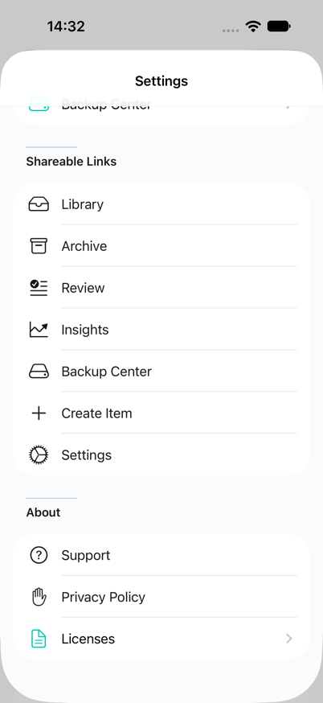 | 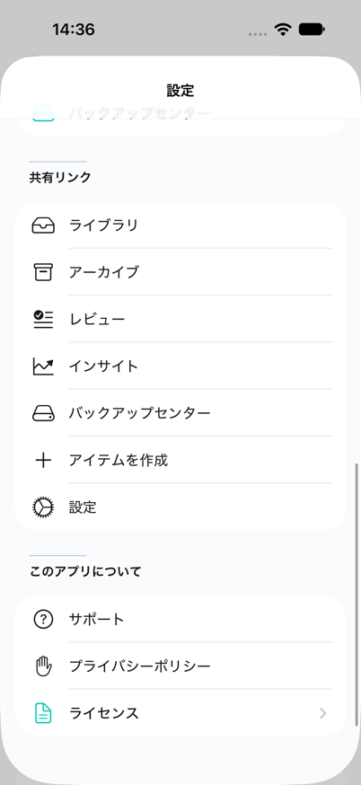 |

The [Japanese maximum-text capture](ui-preview-screenshots/support-preparation/about-ja-axxxxl.png)
and [English maximum-text capture](ui-preview-screenshots/support-preparation/about-en-axxxxl.png)
show the native labels reflowing after scrolling.
The [Safari URL capture](ui-preview-screenshots/support-preparation/support-safari-url.png)
records the approved destination. These are unedited Simulator captures.

The unexpected return is retained as a verification boundary incident. The
original app process logged `model_container.preview_created`; the unexpected
process logged `model_container.local_created` and displayed an empty Library.
It received no further screen actions before termination. No real collection
or CloudKit startup was observed, but an empty local store may have been created
in the dedicated Simulator and was left untouched. Japanese checks then used a
fresh explicit preview launch and verified `preview_created` before interaction.
Do not count every launch in this audit as in-memory or treat the return as a
passed round trip.

After authorized page publication, manually verify both live page contents,
the Issues destination, and return to Stally while retaining the preview process.
Stop if a normal cold launch occurs. Physical VoiceOver and the previous
integration's separate manual checks remain outstanding.

The final preview app and interaction sessions were stopped. Large text size,
light appearance, and disabled Increase Contrast were restored before shutting
down only the dedicated Simulator. Xcode's original Stally scheme was restored
first, its destinations rediscovered, and Stally MHPlatform 1.13 Audit restored
and confirmed. Runtime review found no fatal, crash, or exception output; the
unexpected local-container launch remains explicitly recorded above. Logs,
hierarchies, PID records, and the session ledger are retained in ignored
`.build/ci/stally-launch-preparation-20260914/runtime/`.

## September 14 Read-Only Time Follow-up

The [follow-up assessment](fluel-integration-assessment.md#september-14-follow-up-integration)
selects start-aware browsing, derived yearly milestones, and reusable time
readings. The app changes in `0f91a4f` adapt the Operations added in `dae979e`
and the read-only Check Time Together intent in `3f6fff1`. No saved model,
backup contract, original V1 fixture, or Fluel source changed.

The comparison uses the dedicated portrait iPhone 18 Pro Simulator on iOS 27.0
and Xcode 27.0 build `27A266a`. Before images use the previously installed
`2c5b790` app: the app, library, and project sources were unchanged between that
commit and the starting `9d77f6c` baseline. Native interaction was unavailable
for those captures, so official `simctl` screenshots establish static before
evidence only. The final native app build passed with zero errors and extracted
Stally App Intents metadata. After official installation and explicit preview
launch, a device-specific native session recovered actual app interaction.
Before detail captures use the direct tracking preview hosts; the after Home
capture was reached from Library. The different back-navigation context is not
part of the feature change. All retained images are unedited tool captures.

| Library before | Library after |
| --- | --- |
| 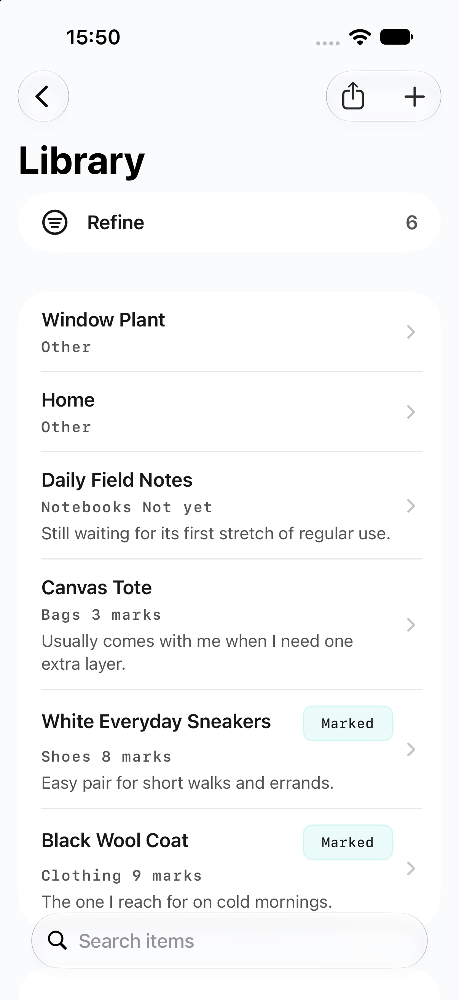 | 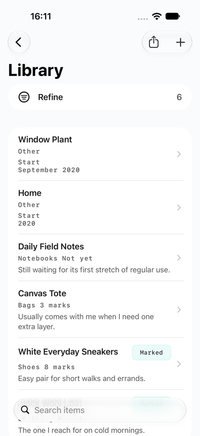 |

| Year-only detail before | Year-only detail after |
| --- | --- |
| 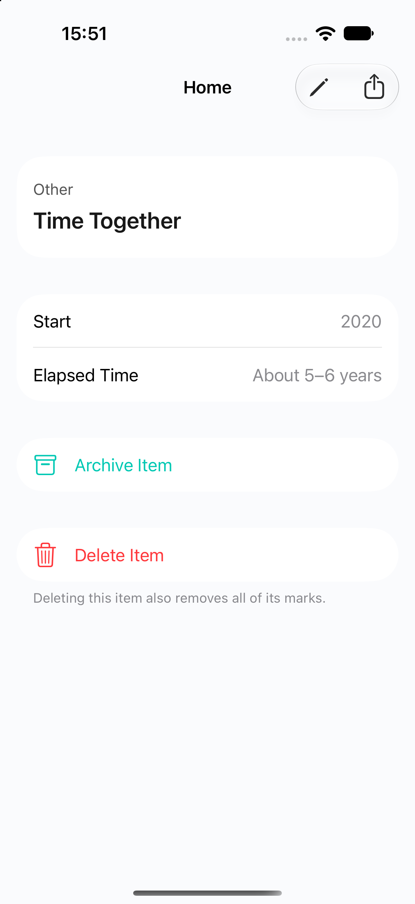 | 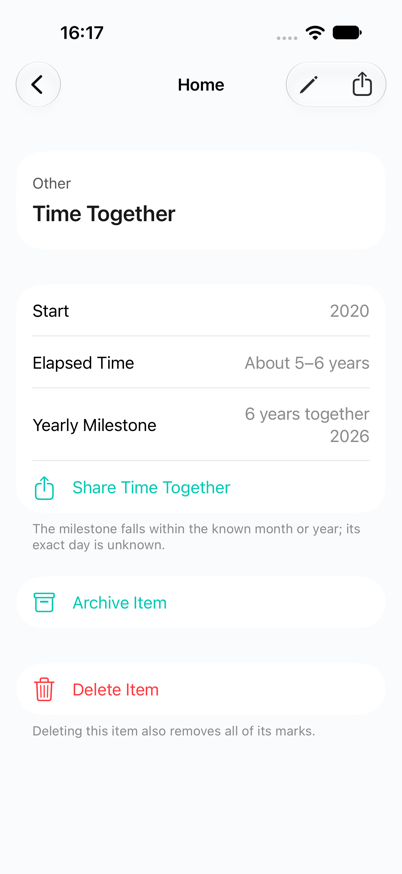 |

The Library additions retain the existing native collection and Refine controls.
Actual selection of Does Not Record Marks and With Start each returned Home and
Window Plant in the mixed synthetic collection. Earliest Start placed Home
before Window Plant; Latest Start reversed them. The
[ordering explanation](ui-preview-screenshots/time-followup/library-earliest-after.png)
remained visible. This compares known start bounds, without claiming exact
durations for overlapping partial dates.

Home retained Start `2020` and Elapsed Time `About 5–6 years`. Its new yearly
milestone showed `6 years together` / `2026`, with a footer explaining that the
exact day is unknown. It did not invent a January 1 anniversary or offer Mark
actions for the non-Mark item.

| Month-only detail before | Month-only detail after |
| --- | --- |
| 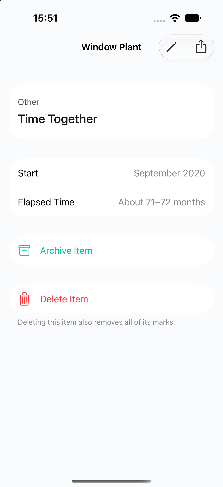 | 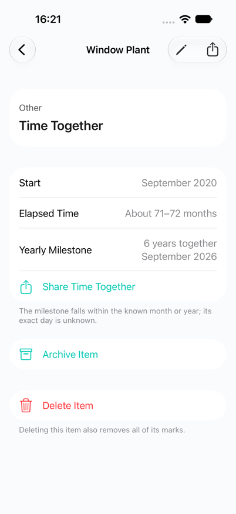 |

Window Plant retained September 2020 and About 71–72 months; its milestone
showed September 2026. In
[Japanese Archive detail](ui-preview-screenshots/time-followup/archived-detail-ja-after.png),
the exact September 13, 2020 start read 2,192 days on September 14, 2026, and
the next milestone remained an exact September 13, 2027 / seven-year reading.
Move Back stayed available and no Mark controls appeared.

Archive's non-Mark filter was actually selected and returned Archived Plant
alone. Latest Start was also selected, and the Japanese ordering footer was
readable after scrolling. A final English Archive check selected Earliest Start
with both items present: Archived Plant preceded the unknown-start Travel
Weekender. With Start was selected in Library; its Archive option was inspected
but not separately selected.

Actual activation of Share Time Together opened the
[native share sheet](ui-preview-screenshots/time-followup/share-time-sheet-after.png).
Its accessibility caption contained Home, the approximate elapsed reading,
Start `2020`, and reference day `2026-09-14`. Tapping the native dismissal region
returned to the same Home screen and app process. No recipient, Copy, Files,
or other share action was selected. This proves presentation and cancellation,
not external delivery. System share destinations used the Simulator's existing
language, independently of the app's English launch override.

### Maximum Text and Confirmed Row Correction

At maximum Dynamic Type, Japanese Archive truncated the new exact start to
`2020年9月…`. The accessibility hierarchy retained the full date, but the visible
row did not. The bounded correction lets only the start text use its full
wrapped height. The final native build passed with zero errors; returning to
the same one-item non-Mark filter showed `2020年9月` / `13日` without omission.

| Japanese maximum text before correction | Same item after correction |
| --- | --- |
| 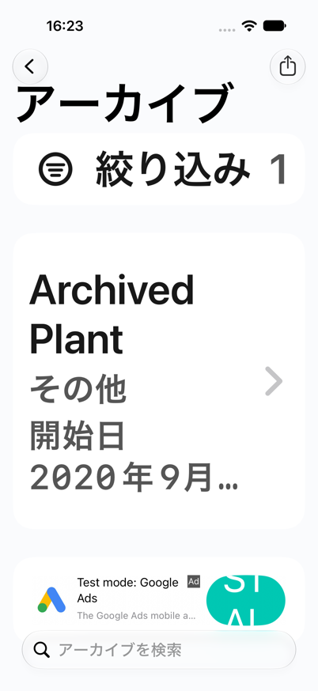 | 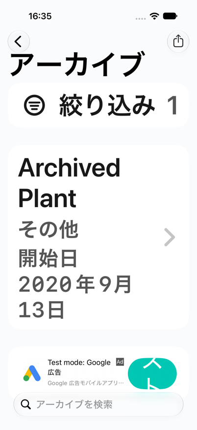 |

The [English maximum-text detail](ui-preview-screenshots/time-followup/year-detail-en-max-after.png)
shows Yearly Milestone, its year-only value, and Share Time Together after actual
scrolling. Japanese maximum-text Archive detail retained both exact start and
milestone dates. The new Japanese filter/sort menu labels were reached by actual
scrolling and displayed in full. The final English maximum-text Refine check
also reached the full Does Not Record Marks, With Start, Earliest Start, and
Latest Start labels. Hierarchy evidence is not a VoiceOver speech or focus-order
check.

| Japanese month milestone and sharing | Same detail after further scrolling |
| --- | --- |
| 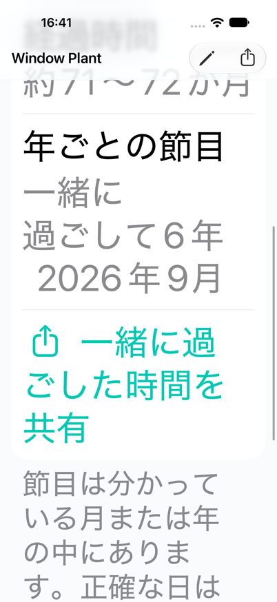 | 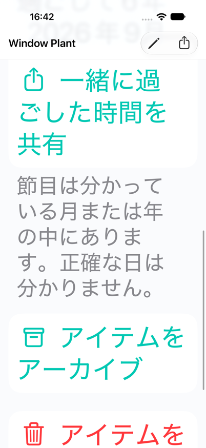 |

The final Japanese month-detail check reached the complete September 2026
milestone, share label, and approximate-date footer through actual scrolling.
The footer remained readable through its final sentence. No day was invented.

The same maximum-text run also exposed clipping in the existing small test ad's
CTA and oversized ad typography after returning to standard text. No ad was
activated. That separate advertising presentation defect is
retained in [release readiness](release-readiness.md#remaining-release-evidence);
the start-row correction does not fix or approve it.

### Verification Boundary

| App language and text size | Targeted screen coverage |
| --- | --- |
| English, standard | Mixed Library, both tracking filters and start sorts, year/month detail, native share presentation and cancellation |
| English, maximum | Year-detail milestone/share labels, Archive Refine labels and Earliest Start selection |
| Japanese, standard | Archive start metadata, exact-day archived detail, month detail |
| Japanese, maximum | Archive date-wrap correction, Refine labels and Latest Start selection, archived exact-day detail, month-detail milestone/share/footer |

The library suite passed 151 tests in 35 suites, including the retained disk
migration and v2/v3 backup checks. Two additional disposable app-adapter probes
executed Check Time Together against copied current Intent/entity sources with
explicit in-memory dependency injection. They do not prove Shortcuts/Siri system
presentation or authentication. Formatter, repository rules, and English/Japanese
catalog checks passed; all six catalogs had zero incomplete entries. The existing
stale Actions key and intentional product-name source copies remain.

The row-only correction repeated the native build, repository rules, catalog
audit, and affected runtime check. It did not change domain or Intent sources,
so the passing library and adapter suites were not rerun for that layout change.

This matrix covers one portrait iPhone in light appearance. New surfaces were
not checked on iPad, in landscape, dark appearance, or Increase Contrast. Those
checks, VoiceOver operation, system Shortcuts/Siri and authentication, exporter
Save, and local-midnight foreground refresh remain unverified here.
For the remaining Archive With Start permutation, use the safe synthetic setup,
open Archive, select Refine > With Start, and expect Archived Plant alone.

All five after-build app processes logged `model_container.preview_created` and
`startup.ready`. The scoped log review found no normal local/cloud-container
startup or fatal, crash, exception, or failed-container output. These are
synthetic Simulator results, not production-runtime evidence. The earlier
Support audit's empty local store was left untouched.

The app and native sessions were stopped. Standard text size, light appearance,
and disabled Increase Contrast were restored and read back. The original Stally
scheme was restored first, valid destinations rediscovered, and Stally MHPlatform
1.13 Audit restored and confirmed. Only the dedicated Simulator was shut down.
No Simulator was erased. Build logs, runtime logs, hierarchies, source hashes,
and full interaction ledgers remain in ignored
`.build/ci/stally-time-followup-20260914/`; the fourteen curated images above are
unchanged copies of the inspected captures.

The [tracking verification record](item-tracking-verification.md#accessibility-and-system-surfaces)
provides the separate system, VoiceOver, and device-size procedures. Release
account, public-page, signing, and device checks remain in
[issue #8](https://github.com/muhiro12/Stally/issues/8); the older development
archive does not verify this later app surface.
